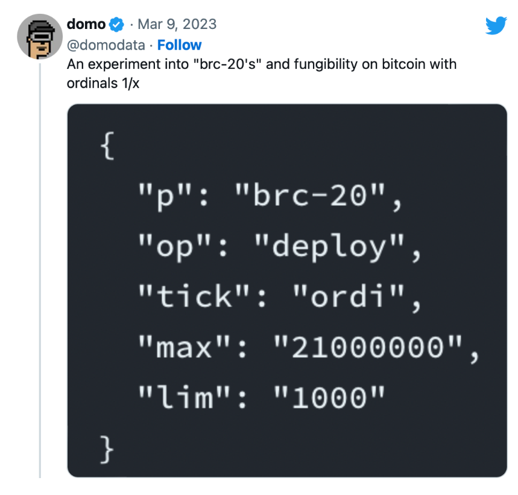
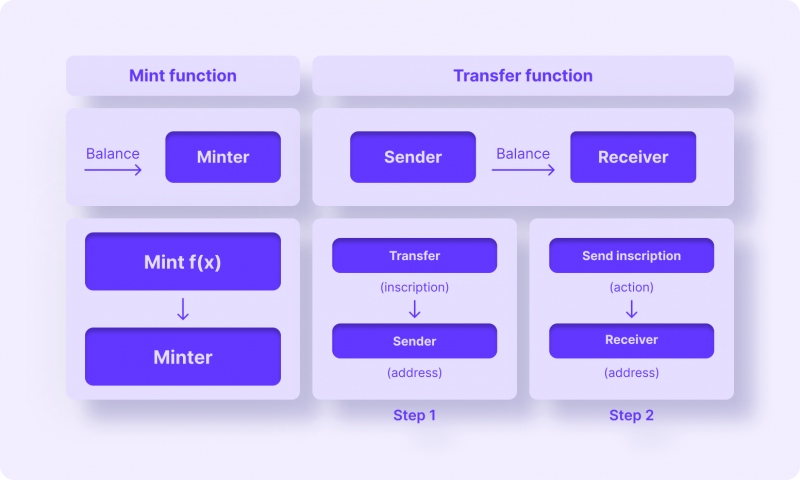
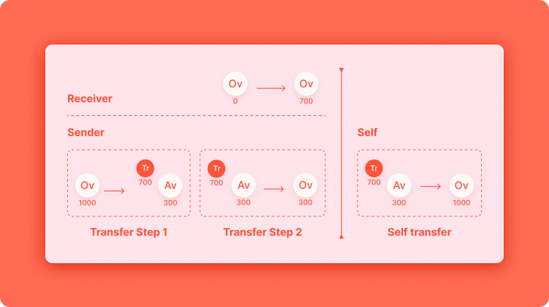
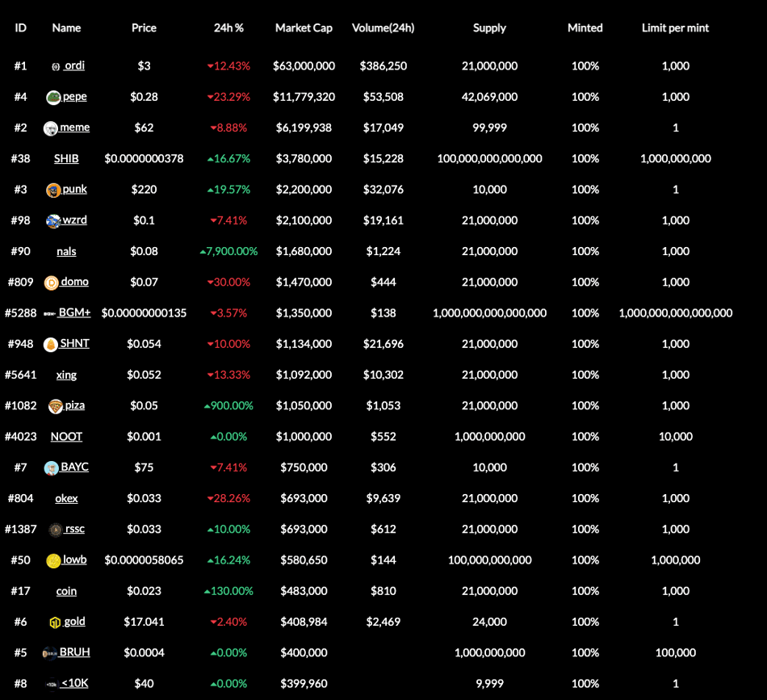
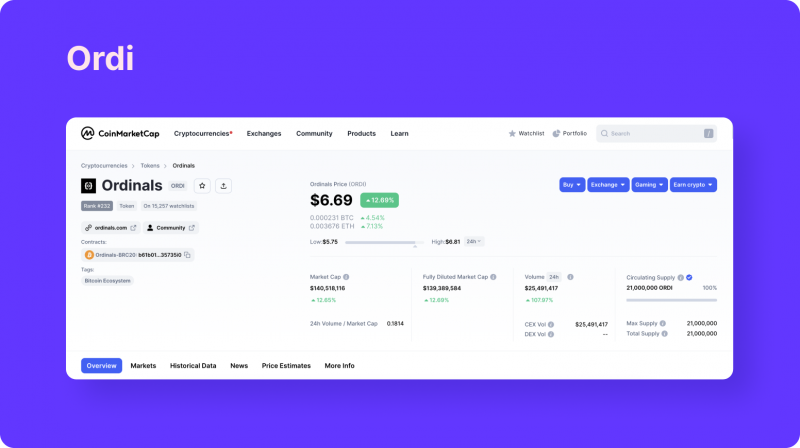
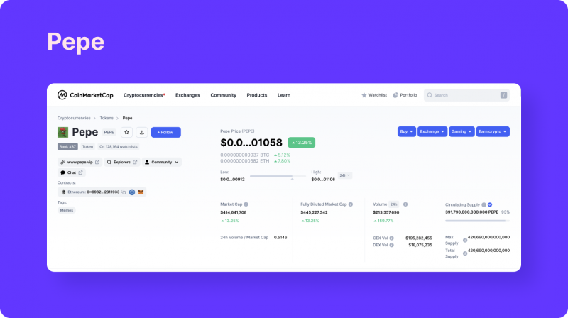
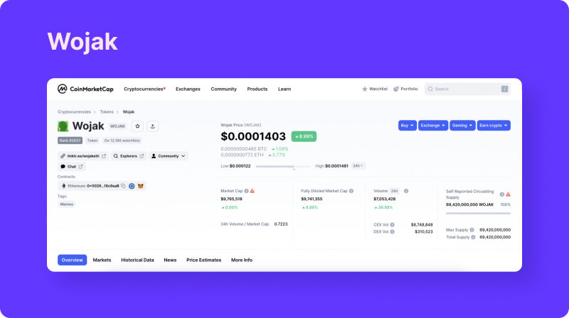
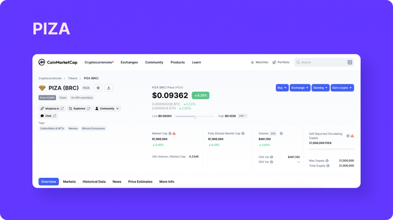

# BRC-20

* 名词 
  * BRC = 比特币请求评论 
  * FT=Fungible Token=可替代代币=同质化代币 
    * 对比 
      * NFT=Non-Fungible Token=非同质化代币 
  * 代币标准 
    * 是什么：代币标准规定了一种加密活动可以如何使用、以及可以在哪里被使用 
    * 举例 
      * ERC-20 
        * 知名代币 
          * Shiba 
          * BUSD 
      * BEP-20 
      * TRC-20 
  * 聪=sat=Sats=Satoshi 
  * 铭文=Inscription 、 铭刻=inscribe 和 mint=铸造 
    * 将铭文Inscription添加在 聪 上的过程即inscribe 
      * 类似于以太坊NFT的铸造（mint） 
  * BTC的NFT 
    * 将铭文信息添加在“聪”上后，即铸造了一个BTC的NFT 
* BRC-20 = BRC20 
  * 一句话总结：比特币生态的ERC20代币协议 
  * 是什么：在比特币上开发的一种新型 FT/代币/同质化代币 标准/协议 
  * 具体内容 
    * BRC-20 就是在Ordinals协议的基础上，规定了附着在每一个聪 上的信息规则，方便不同的用户/开发者/钱包利用统一的规则进行互动/交易等行为 
    * 通过直接将数据写入比特币网络而创建的一种实验性代币，通过Ordinals协议创建，这个标准允许在不同用户之间部署、铸造和转移代币 
  * 来源 
    * BRC-20代币是由一个名为@domodata的Twitter用户于2023年3月8日创建的 
      * 2023年3月，@domodata在Ordinals的基础上，又发布了BRC-20代币协议 
  * 本质：一个比特币 NFT == 一个带有铭文的聪 
  * 核心逻辑 
    * 1.最初有：BTC比特币网络 
    * 2.后来有：Ordinals协议 
      * 内容：给每个比特币编号Sat=Satoshi=聪 + 写入信息到聪上 
        * 写入的信息：文本（text）、图像（image）、音频（audio）和视频（Video） 
      * 效果 
        * BTC的NTF=非同质化代币 
    * 3.再后来有：BRC-20协议 
      * 写入的信息 == 放在铭文中的 是：代币信息 == JSON格式的text文本数据 
        * 从而实现代币的部署和管理 
          * 开发者可以基于这个协议进行发币、记账等操作 
        * 所以又称：BRC-20代币协议 
        * 可以将BRC-20理解为BTC-NFT的一种（变异） 
          * NFT 上铭文刻录的是图片 
          * 但 BRC-20 上铭文都是统一的 JSON 格式的文本数据 
      * 效果 
        * 在NFT的Ordinals协议基础上，支持FT=同质化代币 
      * 注意 
        * 其不能与智能合约进行交互 
  * 细节
    * 
      * p：代币根据BRC-20代币标准发行 
      * op：在此交易中调用的操作是ordi代币的部署或初始化 
      * tick：代币的交易代码为ordi 
      * max：ordi代币的最大供应量为21,000,000个代币 
      * lim：一次交易中最多可以铸造的ordi代币数量被限制在1,000个代币 
  * 铸造
    * 
  * 转移
    * 
  * 机遇和想象力 
    * 1、一切重来的吸引力。就像Meme代币一样，即使没有价值，共识的力量却不容忽视。当所有人都认为BRC-20有价值时，这个故事就成功了。BRC-20提供的是一种一切重来的机会，大家在以太坊上错过的NFT和Meme等，在BTC又可以重来了，FOMO情绪使然。 
    * 2、比特币拥有众多实力分叉币。BRC-20同样可以在BCH、LTC、BSV等老牌分叉币上进行，有足够的纵深空间。也给其他链提供了新的思路。 
    * 3、矿工收益增加。链上交易的活跃让矿工的收益不再依赖于比特币奖励，交易手续费的占比将大幅提高。 
    * 4、叙事覆盖面广。NFT、Meme、挖矿、交易所、Web3，几乎所有主流的叙事概念都能和BRC-20沾边，大家曾经见过的故事很有可能在比特币生态里重新演绎。 
    * 5、解锁“聪”的价值。“聪”作为比特币的最小单位，在诞生至今并未发挥太多作用，在被赋予价值后，比特币或迎来新的计价时代。 
  * 风险和弊端 
    * 1、BRC-20代币只是存放在比特币链上的信息，并不具备比特币的安全性和去中心化程度。BRC-20就像写在纸上的信息一样，在没有机构背书前就是一张纸的价值 
      * BRC-20似乎在其前辈的脚步中前进，因为这种令牌标准只是存储在比特币网络上的一种数据类型 
        * 发行后用户只能将此令牌在不同的钱包之间移动 
          * 比如 
            * 可以把BRC-20代币存储在Unisat钱包 
    * 2、由于铸造非常容易，成本仅仅是将信息写入区块链中，这会产生大量毫无价值的代币，只有单纯的炒作机会，比山寨币的风险更高。 
    * 3、由于铭文永久在链上存储，导致区块变得更加臃肿，链上存储和转账的成本大幅增加，这占用了比特币支付交易网络的资源。 
  * (BRC-20令牌=代币)市场概况 
    * 共有4984种类型 
      * [BRC-20加密货币概念板块的代币有哪些？| CoinCarp](https://www.coincarp.com/zh/category/brc20/)
        * https://www.coincarp.com/zh/category/brc20/
    * 总市值约为4200万美元 
  * 具体应用=代币 
    * meme 通证 = meme代币 
      * ORDI=ordi 
        * 是第一个创建的BRC-20令牌 
        * 也是市值最大的令牌 == 市值高达2300万美元 -> 占据了BRC-20令牌市场总市值的50%以上
          * 
        * Ordi 是在 BRC20 上创建的第一种代币，也是这个市场上最受欢迎的产品之一。Ordi使用序数协议，多亏了它，任何信息都可以写入最小的比特币粒子 ——satoshi。考虑到有2.1千万亿个这样的粒子，可能性是无穷无尽的。奇特的是，Ordi是作为一个笑话项目而创建的，并根据革命性技术进行调整，开玩笑的状态迅速变得严肃起来。今天，它是比特币网络能力的基准。 
          * 
      * PEPE=pepe 
        * Pepe 代币是基于悲伤青蛙Pepe的著名模因，该模因于 2005 年首次出现在Matt Fury（马特·弗瑞）的男孩俱乐部漫画中，后来成为支持美国前总统唐纳德·特朗普的象征。像其他模因硬币一样，它没有基本价值，只是由于社区成员的兴趣而增值。在撰写本文时，该代币在BRC-20代币市场上占据了领先地位之一，日交易量超过60万美元。 
          * 
      * Wojak 
        * Wojak是一个加密货币项目，允许用户探索模因的世界，包括通过去中心化网络买卖它们。它的灵感来自同名的标志性互联网模因，其形式是一幅带有悲伤男人脸的图画。 
        * 迄今为止，Wojak（WOJAK）在17个交易所进行交易，包括Bitget、LBank、Uniswap（v2）等。最大交易量可在交易对WOJAK / USDT上观察到，达到300万美元（占所有交易所总交易量的87%）。 
          * 
      * Piza 
        * Piza模因代币跻身于BRC-20的前茅，市值超过1000万美元，日均交易量为80万美元，成为近期最成功的模因币之一，在市值方面仅次于上述几种代币。 
          * 
      * oshi 
      * meme 
      * nals 
    * 其他 
      * VMPX 
  * BRC20 项目汇总网站 
    * https://brc-20.io/market
* 对比 
  * BTC-NFT和ETH-NFT的区别？ 
    * BTC-NFT：真正永久的存储在比特币链上 
    * ETH-NFT：只会将NFT的元数据（类似于文章有标题、作者、发布时间、标签等等信息）存储在区块链上，实际的内容数据并不在链上 
  * 比特币的BRC-20 vs 以太坊的ERC-20 
    * 定义内容不同 
      * 比特币的BRC-20 ：仅仅是在比特币上存储数据的一种方式 
      * 以太坊的ERC-20：不仅包括存储，还包括转移等成套的协议 
    * 市场概况 
      * BRC-20令牌总市值约为4200万美元 
      * ERC-20令牌的总市值高达数千亿美元 
    * 区块链起源和生态系统 
      * BRC-20：BRC-20代币在比特币区块链上运行，比特币区块链作为最早的区块链之一享有良好的声誉，并有望在未来继续崛起。 
      * ERC-20：另一方面，ERC-20代币基于以太坊区块链，以太坊是区块链行业的早期参与者之一。以太坊的智能合约能力和庞大的开发者社区已经确立了ERC-20作为代币创建 
    * 代币创建和管理 
      * BRC-20：BRC-20 代币是通过使用 ordinal 铭文来创建和管理的，这涉及直接在比特币区块链上存储 JSON 数据。这种方法无需依赖智能合约，提供了一种独特的可编程性。 
      * ERC-20：ERC-20 代币是通过以太坊的智能合约创建和管理的。这些自执行的协议自动化了代币的发行、分发和管理，提供了灵活性和安全性。 
    * 可替换性 
      * BRC-20 和 ERC-20 代币都是可替换的，这意味着它们可以与同类型的其他代币一对一交换，从而允许无缝交易并集成到各种兼容的应用程序和平台中 
    * 交易费用和可扩展性 
      * BRC-20：BRC-20代币在比特币区块链上运行，该区块链在交易费方面受到了一些批评。原始铭文的设计导致了这些费用，这使得BRC-20交易相对于其他区块链而言可能更昂贵。 
      * ERC-20：以太坊网络上的交易费用也是人们关注的话题，尤其是在网络高拥堵时期。以太坊的可扩展性挑战导致交易处理时间变慢，高峰期间费用更高，促使许多 Web3 用户转向可扩展性解决方案，例如 Layer 2。 
      * 注：需要注意的是，交易费用可能会根据网络使用情况、gas 费用以及代币运行的特定区块链而有很大差异。 
    * 用例和采用情况 
      * BRC-20：BRC-20 代币在各种用例中都有应用，包括点对点转账、汇款，以及潜在的 DeFi 协议集成。币安智能链的高速和成本效益使其成为希望与区块链技术互动而不产生高额费用的用户和开发者的理想选择。 
      * ERC-20：ERC-20 代币已成为主流加密货币交易所和去中心化金融平台运作的核心。广泛的采纳和兼容性使 ERC-20 巩固了它作为主导代币标准的地位。ERC-20 代币用于包括交易、借贷、借款和在 DeFi 平台上的流动性挖矿等多种应用。另一显著用例 NFT 已获得巨大人气，主要建立在 ERC-20 标准上。ERC-20 代币的活跃生态系统为用户提供了一系列选择，而以太坊区块链的强大基础设施确保了这些代币的安全性和可靠性。 
    * 未来前景 
      * BRC-20：BRC-20生态系统正在不断发展，开发团队积极致力于增强功能，使其更易于开发人员使用。随着 DeFi 领域的持续扩展，预计 BRC-20 将在加密货币领域发挥重要作用。 
      * ERC-20：ERC-20代币已经建立并被广泛采用，但它们面临着与可扩展性相关的挑战。 
  * 引申出：很多公链基于Ordinals的新RC20协议 
    * ARC20 
    * IERC20(以太坊) 
    * CBRC20 
    * SOL20(Solana) 
    * DRC20(DOGE) 
    * ASC20(AVAX) 
    * ORC20 
    * LRC20(莱特币) 
    * TRC20(波长) 
    * SRC20（只支持1开头的比特币地址） 
    * Ethrunes（以太坊符文） 
