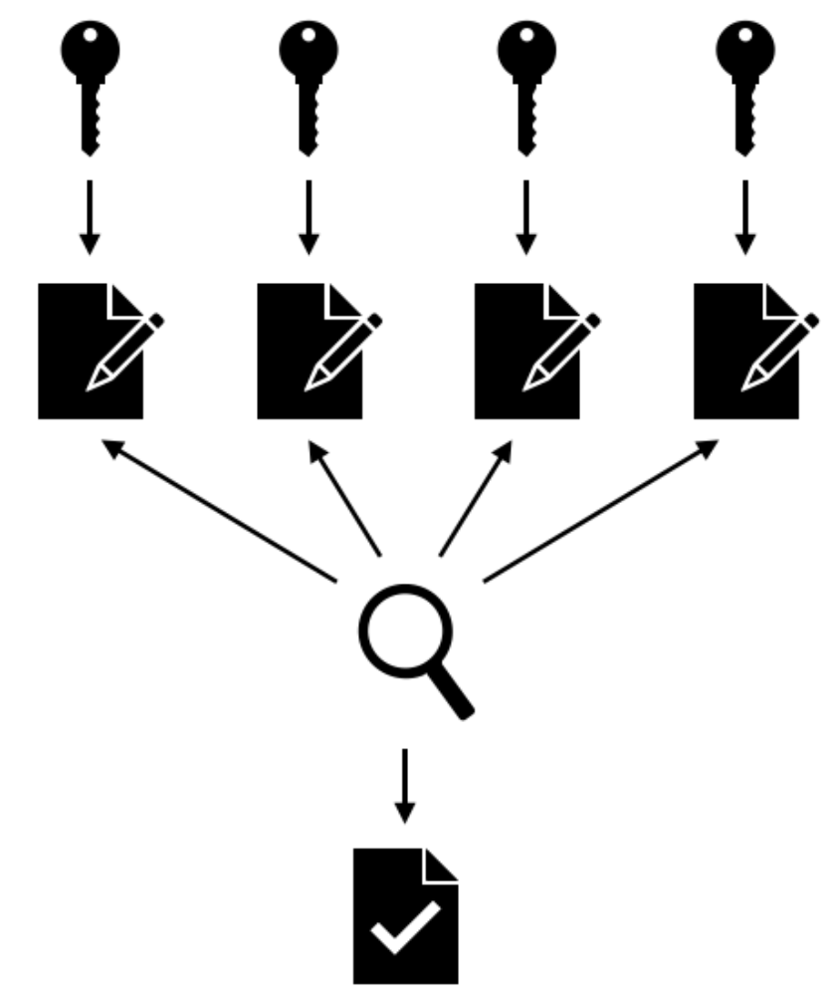
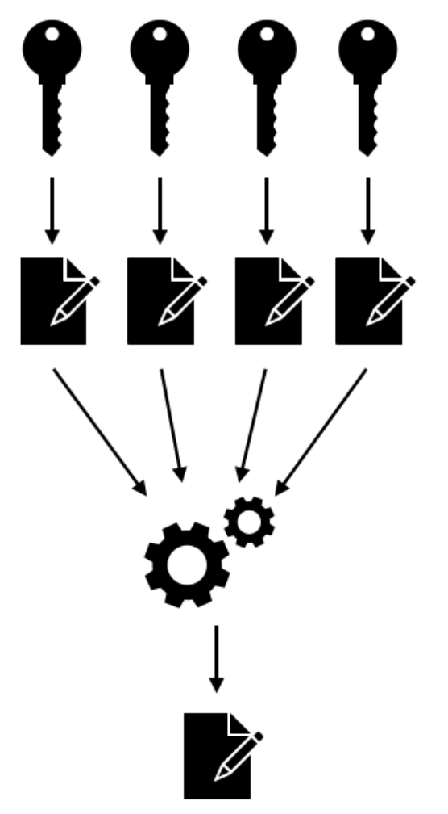
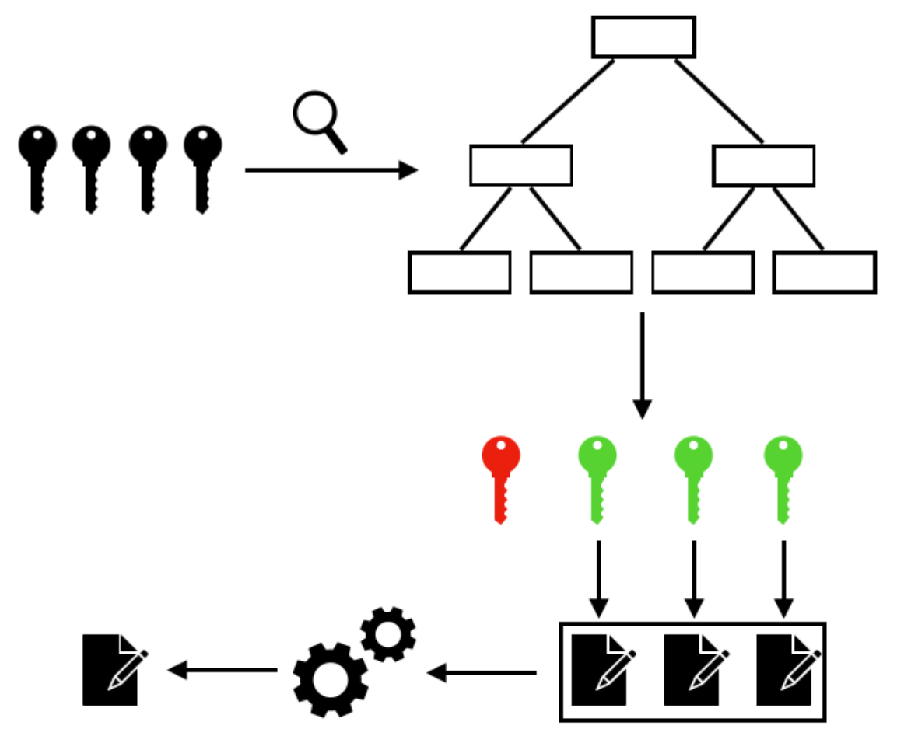
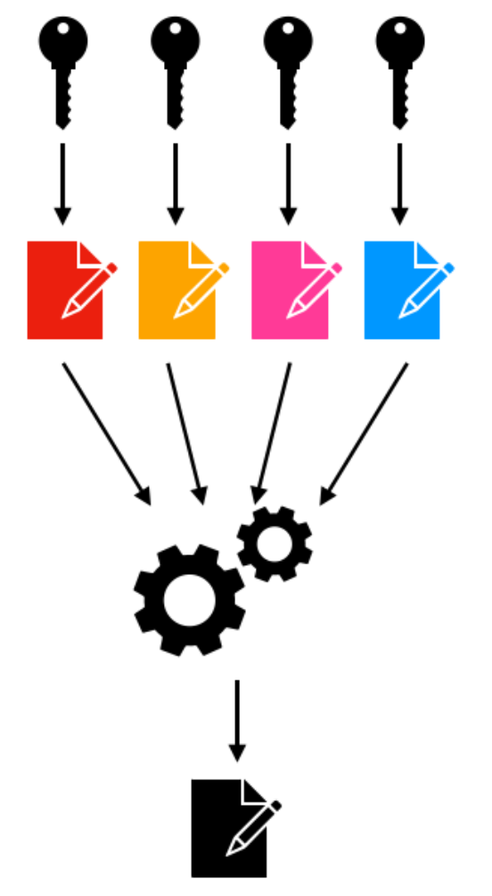
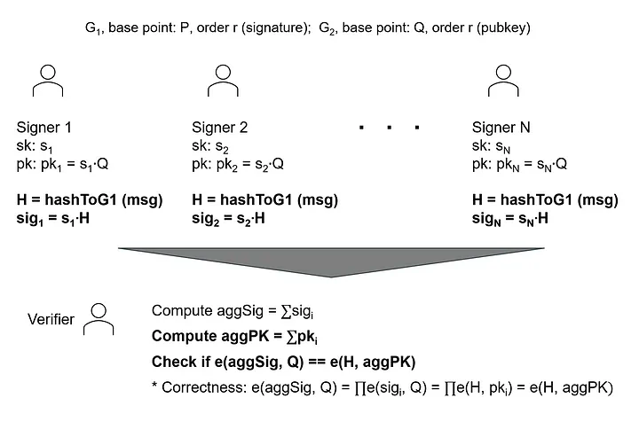
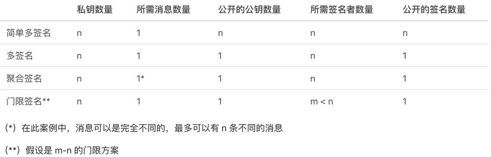

# 数字签名

* 背景 
  * 数字签名在区块链技术中扮演着举足轻重的角色，每一笔交易都需要签名才能成为一笔有效的交易 
  * 数字签名在区块链协议中有三方面的目标 
    1. 证明所有权，并为花费资金提供授权 
    2. 证明了不可否认性，意思是这个授权的证据是无法否认的 
    3. 证明了被签名的交易没有被篡改，也无法被篡改（与签名不匹配会使交易失效） 
  * 常见的签名方案中，单个用户为其消息生成签名；这就有一个潜在的风险：它构成了一个足以使该方案崩溃的单点故障，不法分子一旦获得了你的私钥，就可以拿走该私钥控制的所有资金。 
  * 解决方案 
    * 多签名 
    * 门限签名 
  * 另外： 
    * 聚合签名 
* 数字签名方案 
  * 多签名（Multisignatures） 
    * 详解 
      * 在简单的多签名方案中，n 名用户中的每一个都有独立的一对 公/私钥，而一个有效的签名，是 n 个用户的签名的集合。最终签名的验证需要用到每一个签名者的公钥。 
        * 
      * 让每一个参与者都能持有自己的密钥对，使得基于多签名的授权证据占据多得多的空间。需要 n 个签名的设置不仅要在证据中包含 n 个签名，还要包含 n 个公钥。这使得多签名交易更昂贵，因为其体积和处理成本随 n 的增大而线性上升。 
      * 另一方面，用户有自己个人的密钥对，可以并行参与多个签名流程，这跟门限签名相反。在门限签名中，每一个参与者都只拥有一份密钥，可以签发 一部分 签名。这些签名碎片必须组合起来才能生成有效的最终签名。显然，这些密钥也许不能独立参加另一个签名流程。 
      * 参与多签名方案的密钥是存储在 链上 的，而在门限签名方案中，计算和密钥分割都是在 链下 完成的，只有一个公钥会存储在链上。这使得门限签名比多签名在体积和验证开销上更为便宜。 
      * 简单的多签名方案可能并不是区块链的最佳解决方案，因为其效率低下。为了解决这个问题，一些解决方案允许所有参与者用自己的私钥签名消息，然后这些签名会被组合成一个签名，并使用一把组合公钥来验证。这就是 MuSig2 及类似方案所用的机制，我们下文再叙。 
        * 
    * 常见多签名方案 
      * MuSig2 = MuSig2（Nick et al.)
        * 概述 
          * MuSig2（Nick et al.）不能被视为一种常见的多签名方案，因为它跟聚合签名方案有一些相似之处。 
        * 亮点 
          * 可以安全地并行签名 
          * 可以聚合密钥 
          * 产生的输出是常规的 Schnorr 签名 
          * 将通信轮次减少到了两轮，而更早的协议 MuSig 需要进行三轮通信 
          * 签名者面对的复杂性与普通的 Schnorr 签名相似 
        * 详解 
          * 在 MuSig2 中，每个参与者都有一对公私钥。它们是使用随机数 x ∈ ℤ （私钥）计算 X = g ^ x （公钥）来生成的（g 是一个循环群 G 上的生成点）。 
          * 这个方案使用两轮通信来让 m 个用户生成 m 个中间签名，这些签名结合在一起生成一个最终的签名。 
          * 这个签名使用这些用户的公钥所结合生成的一把公钥来验证。 
          * 在使用这种方案来为区块链交易授权时，最终保留在链上的只有一把公钥和一个签名，因此其成本远低于多签名、等同于使用门限签名机制所生成的签名。进一步地，MuSig2 中的密钥生成比门限签名中的密钥生成要简单。与任何门限签名方案相比，MuSig2 的主要缺点在于，它需要 m 个签名者参与（m = n），所以 MuSig2 也成了一个死板的解决方案 
      * 将多签名转为门限签名 
        * 要让一种多签名方案更加灵活，一种可行的解决方案是修改算法，将之转为一种门限签名方案。这一方向需要定义一种默克尔树来包含所有可能的签名者组合的密钥。这棵默克尔树将允许我们靠遍历来检查一组签名者是不是有效的签名群组。 
          * 
        * 设 n 为参与者的数量，而 m 为阈值。则上述的默克尔树需要包含的元素数量为 C(n,m) 。这棵树的空间复杂性 O(n^(n-m)) 将与阈值呈指数关系，这也很直接能推理出来：阈值 m 越小，C(n,m) 越大。 
        * 在一棵默克尔树上搜索、遍历、插入和删除元素的时间复杂度 O(log(C(n, m))) < O(log(n^m)) =O(m · log(n)) 。 
        * 使用默克尔树来存储所有可能的签名群组的想法，可以跟 MuSig2、BLS 以及任何多签名方案相结合。这个特性在比特币的 Taproot 升级中以 MAST（merkelized abstract syntax trees）为名，它使用默克尔树来存储多个用户指定的、为花费该笔比特币需要满足的充分条件。 
  * 聚合签名（Aggregate signatures） 
    * 详解 
      * 在别的应用中，聚合签名被用于减少证书链条的体积，或者在路由协议中减少消息的体积。 
      * 聚合签名是多签名（所有用户签名同一条消息）的重要一般化。聚合签名方案允许为 m 个不同签名者对 m 条不同消息的 m 个签名创建一条致密的签名。这就提供了更快的验证速度以及空间和带宽上的节省。 
    * 目标 
      * 聚合签名要能限制任何敌手在一个普通用户的签名上创建有效的聚合签名 
    * 签名聚合的机制 
      * 举例 
        * 现假设有一组 m 个用户，各有一对公私钥，而用户 i 想签名消息 Mi。 
      * 一般化聚合 
        * （m 个用户中的）每个用户 i 都对自己的消息 Mi 创建签名 σi 。在创建 一个聚合签名时，任何人都可以运行公共聚合算法，将全部 m 个签名压缩成单个签名 σ。 
      * 序列式聚合 
        * 用户 1 签名 M1 来获得 σ1；用户组合 σ1 和 M2 来获得 σ2，以此类推。最终的签名是由用户 k 结合 Mk 和 σk-1 获得的。序列式签名聚合只能在签名流程中完成。 
          * 
    * 签名聚合示例（当 N 个人签署同一条消息时） 
      * 
    * 常见签名聚合技术/协议 
      * 注意： 
        * 这些协议签名的都是 同一条消息，所以应该把它们当作是多签名的案例，而不是聚合签名方案的合适案例 
          * 其实应该叫做：具备聚合特性的多签名方案 
        * 依然需要指出的是，大部分的这些方案都要求特定的签名顺序，但也有方案不再有这方面的要求（见 Lu et al. 的论文） 
      * Schnorr 签名 
      * lattice-based=基于格的签名 
      * pairing-based=基于配对的签名 
        * BLS 
          * 由 Boneh et al. 提出 
          * 区块链应用案例 
            * Dfinity 
              * [The Internet Computer for Geeks: A New DFINITY White Paper | by DFINITY | The Internet Computer Review | Medium](https://medium.com/dfinity/the-internet-computer-for-geeks-a-new-dfinity-white-paper-ecb075b2d525)
            * Algorand 
              * https://www.algorand.com/technology/white-papers
  * 门限签名（Threshold signatures） 
    * 详解 
      * 一个 m-n 的门限签名方案，指的是一组 n 个签名者中任意 m 个乃至更多的签名者即可代表整个群体、生成有效签名的数字签名方案。这个签名后面可以用一个 群体公钥 来验证，而这个群体公钥是由参与者个公钥组合而成的。一般来说，门限签名不会暴露参与生成签名的实际成员。 
      * 每一组签名者都可以由一个受信任的群主来管理，由群主来决定谁加入和离开群组。同一个群主可以管理多个群，反过来一个群也可以将群主完全分发给群成员，使得每一个成员都参与到所有的管理操作中。 
      * 群 G 的 n 个成员中，任意 m 个成员构成的子集都可以生成出有效的签名。在创建签名时，每个成员都贡献一个签名碎片给特定的组合人，组合人会从这些签名碎片中推导出预想的门限签名。 
      * 任何人只要能获得群 G 的群体公钥，就可以验证门限签名。而大家指定的组合人既可以是一个真实的实体（比如受信任的群主），也可以是一个虚拟的实体，其操作以分布式的形式在所有群成员中计算。只要被指定的组合人可以在接受一个碎片签名作为门限签名的输入之前验证其有效性，这种门限签名方案就是健壮的。 
    * 目标 
      * 控制签名能力（m > 1），或者消除单点故障（n > 1），又或者兼而有之 
    * 常见方案 
      * FROST==Komlo and Goldberg 
        * 使用一种准受信任的签名聚合者（SA）设置，该设置的存在可以减少带宽开销。 
        * 聚合者是为协作而设置的，并没有信息上的特权。SA 既可以是协议的一个参与者，也可以是一个外部的第三方。SA 要负责识别行为不轨的参与者，并在协议完成时发布群体的签名。即使 SA 自身行为不轨，协议也可对抗适应型选择性明文攻击。恶意的 SA 有能力发起分布式拒绝服务攻击，也可坏人先告状，但无法获得参与者的私钥，也无法使不合适的信息得到签署。 
        * FROST 里的密钥生成需要两轮通信，并依赖于 Pedersen 的分布式密钥生成算法，不过签名算法是基于累加型密钥分割（additive secret sharing）的。 
        * 此外，签名操作利用绑定技术来避免伪造攻击。签名流程由两部分组成：一个预处理阶段和一个单轮的签名阶段；但也可以把两个阶段合而为一。 
  * 对比 
    * 
