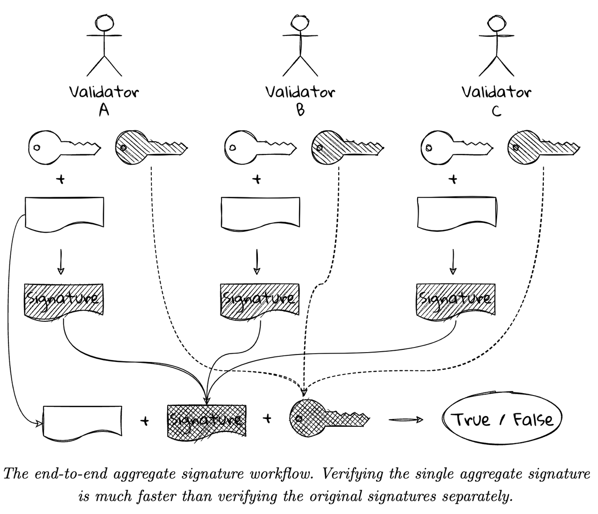
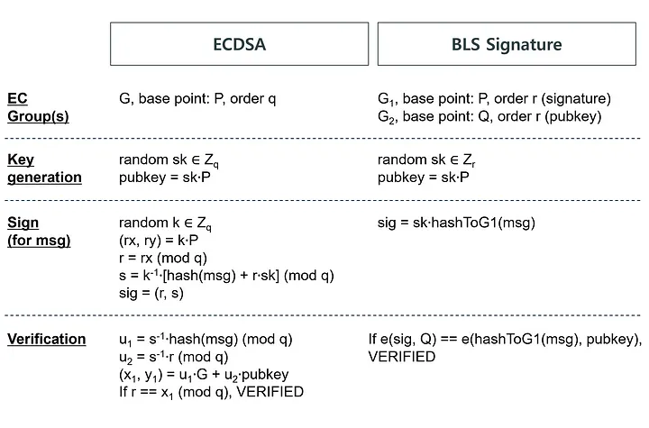

# BLS

* BLS签名算法 
  * BLS=Boneh-Lynn-Shacham 
  * 概述 
    * （常称为）聚合签名算法中的一种 
      * 严格的说应该是：pairing-based基于配对的，具备聚合特性的多签名方案 
    * 最初是由斯坦福大学教授Dan Boneh等人于2001年提出的一种签名方案，最新是在2018年，Boneh教授与IBM研究机构的Manu Drijvers等人更新了这种签名方案 
    * 与以往签名方案不同的是，BLS采用了基于双线性映射的椭圆曲线配对技术，来实现签名验证与聚合 
  * BLS签名过程 
    * 1. 准备阶段，秘密选取随机数字作为私钥pk，计算公钥P = pk × G，待签名的消息m。 
    * 2. 签名与验证：将消息哈希H(m)映射到曲线上的点,记为q，将结果点乘以私钥得到签名: S = pk × q 
    * 3.验证签名： 按照步骤1同样计算出映射到曲线点q,检验 e(P, q) = e(G, S) 
  * 流程图 
    * The end-to-end aggregate signature workflow. Verifying the single aggregate signature is much faster than verifying the original signatures separately 
      * 
* 对比 
  * ECDSA 和 BLS 签名的算法比较
    * 
  * 签名算法 
    * ECDSA：对普通数据签名 
      * 缺点：无法做签名聚合或者密钥聚合 
        * 因此只能挨个对签名进行验证 
        * 在验证多重签名的交易时，此举过于繁琐，我们需要逐个验证所有的签名及其对应的公钥，耗费大量的区块空间和交易费 
    * Schnorr：可以把一笔交易中的所有签名和公钥合并成单个签名和公钥，且合并过程不可见（无从追溯这个签名或公钥是否通过合并而来） 
      * 优点 
        * 可以一次性对合并后的签名做验证，加快了区块验证的速度 
      * 缺点 
        * 多重签名需要多次（签名者之间的）通信，这对冷钱包来说过于麻烦。 
        * 聚合签名算法依赖随机数生成器，而不像 ECDSA 那样可以使用指定的随机点（R） 
        * m-n 多重签名机制比较取巧，需要构建公钥的默克尔树。当 m 和 n 较大时，树所占空间会相当大。 
        * 无法把一个区块中的所有签名聚合成一个签名 
    * BLS 签名算法：支持签名聚合或者密钥聚合，且解决了Schnorr签名算法的上述所有问题 
      * 优点 
        * 不需要随机数生成器 
        * 可以将区块中的所有签名聚合成一个，容易实现 m-n 多重签名 
        * 避免签名者之间的多余通信 
        * （签名的）长度更短（签名为椭圆曲线上的一个点而非两个） 
          * 是 Schnorr 或 ECDSA 的 2 分之一 
