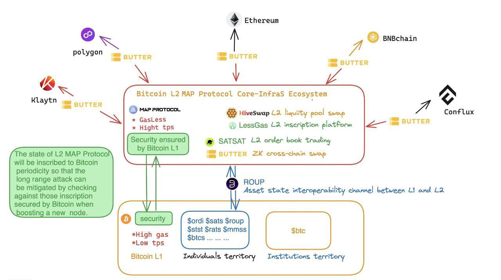
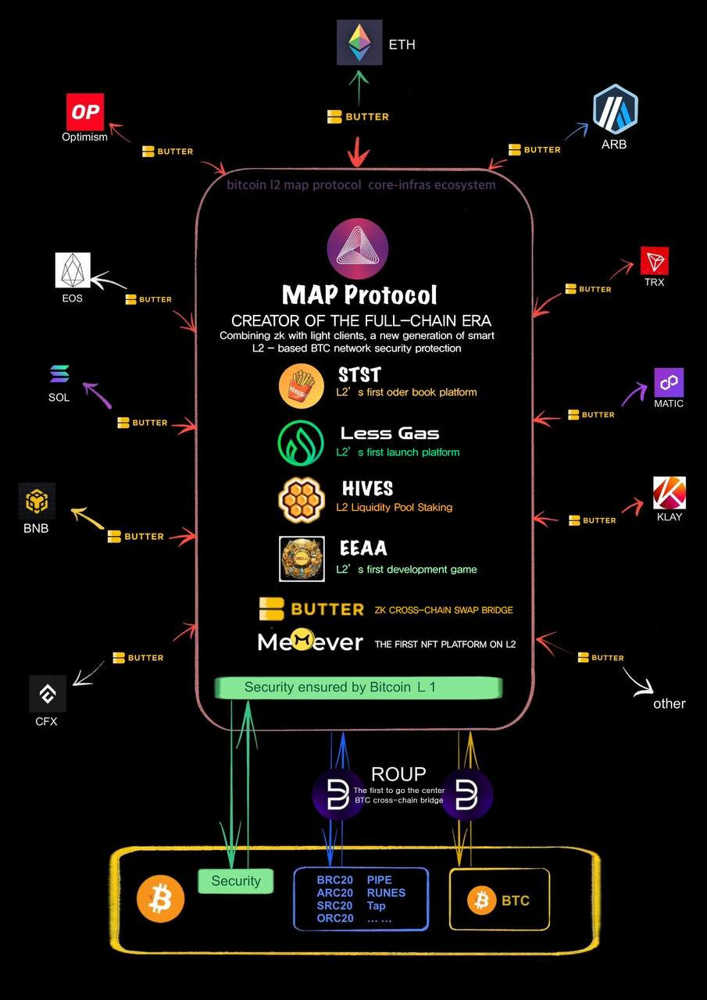
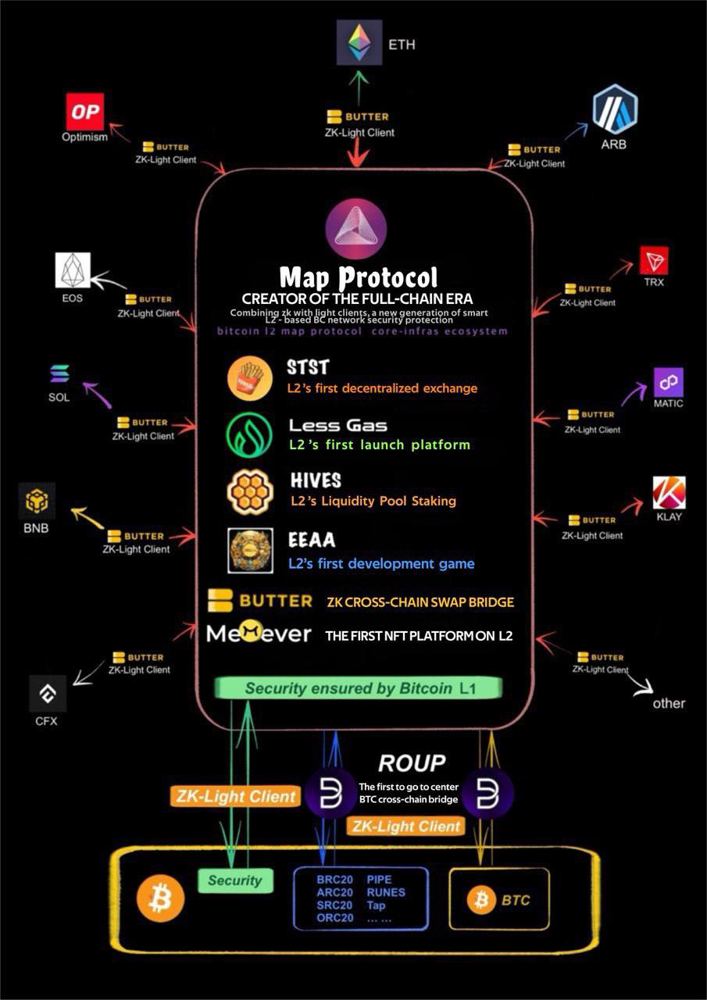
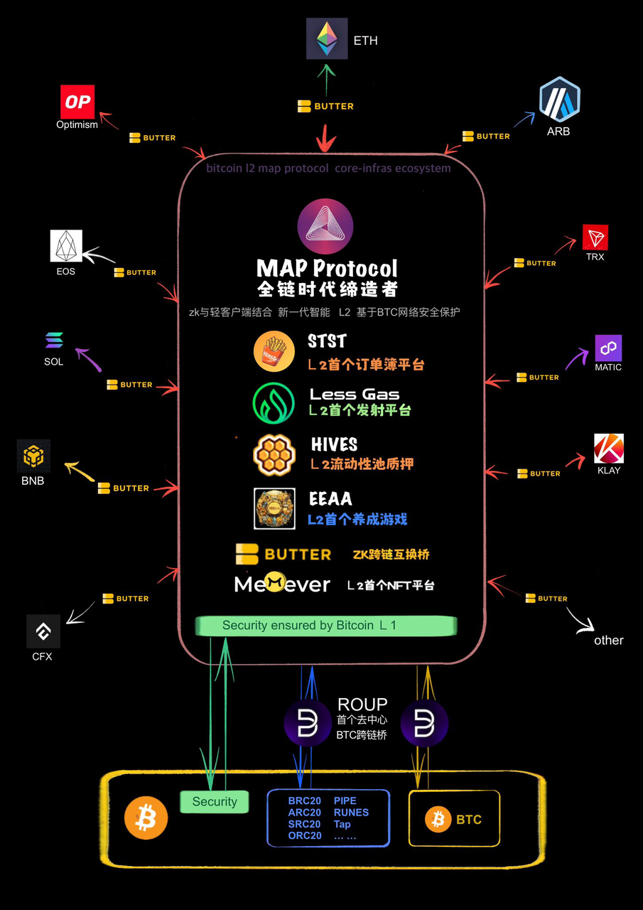
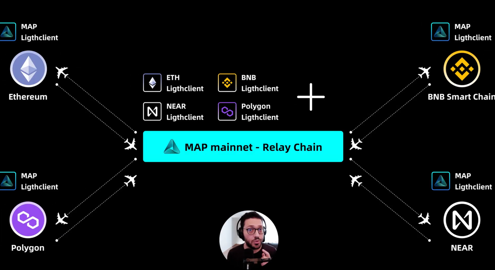
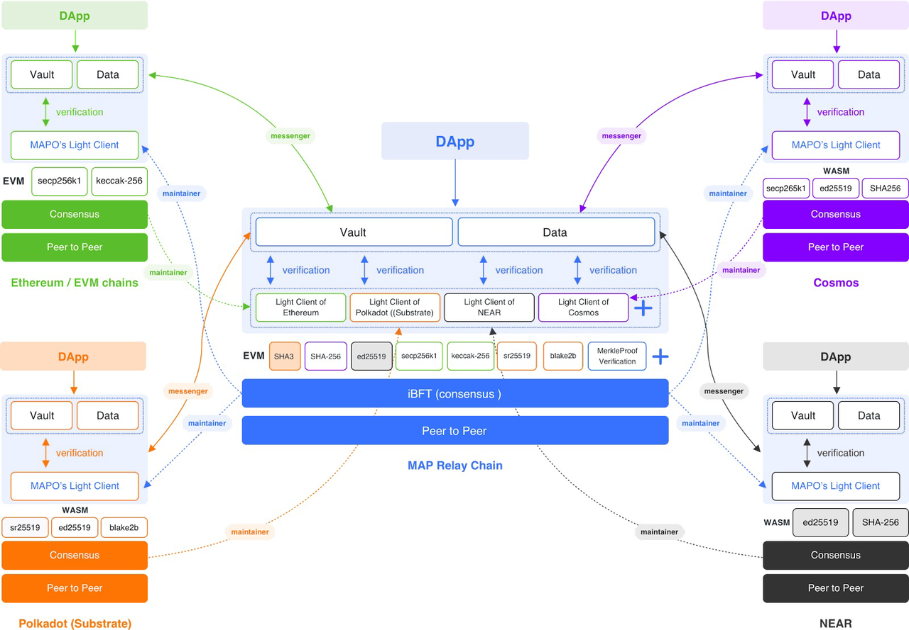
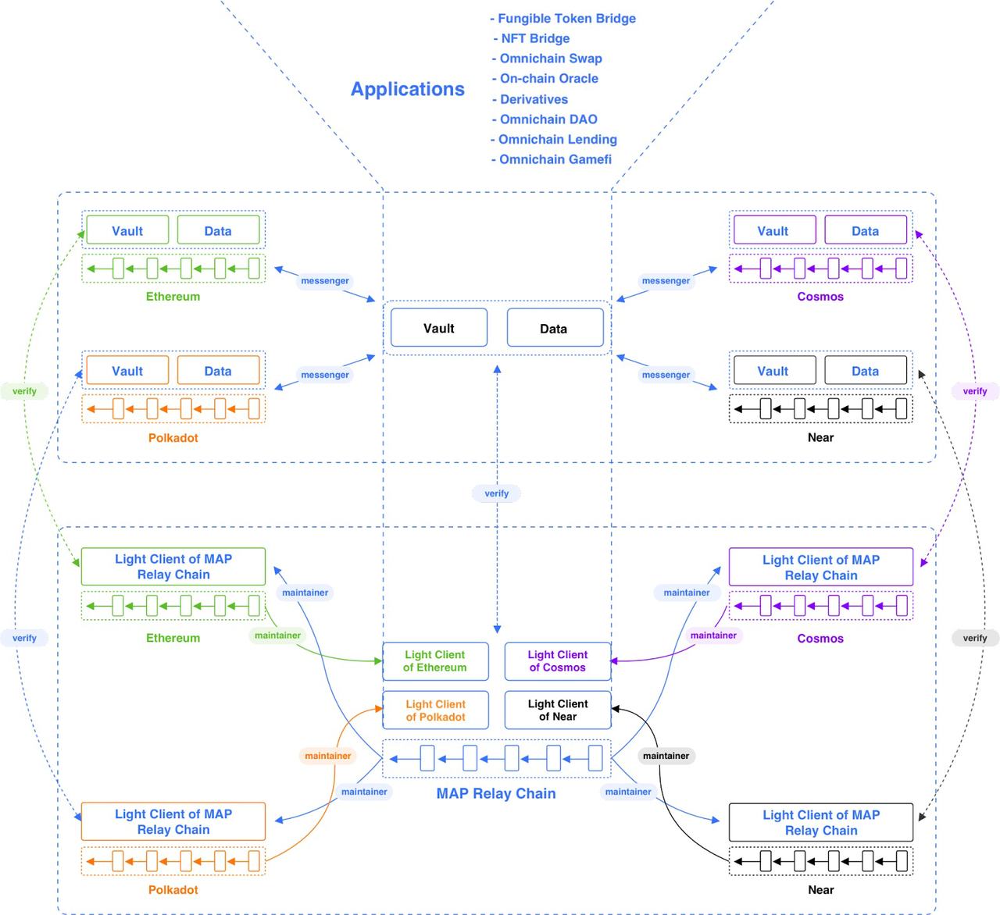

# 架构

## MAP协议全链生态图

* MAP协议全链生态图
  * 精简版
    * 
  * 英文版
    * MAP Protocol Omni-Dapp Chain Ecosystem.jpg 
      * 
    * MAP Protocol Omni-Dapp Chain Ecosystem - detailed.jpg
      * 
  * 中文版 
    * MAP协议全链应用生态图.jpg
      * 

## MAP协议原理架构图

* `MAP Protocol`=`MAP协议`的原理架构图
  * MAP协议跨链逻辑图
    * 
  * MAP协议跨链互操作图
    * 
  * MAP协议三层架构图 = MAP Protocol Three-Layer Architecture
    * 
