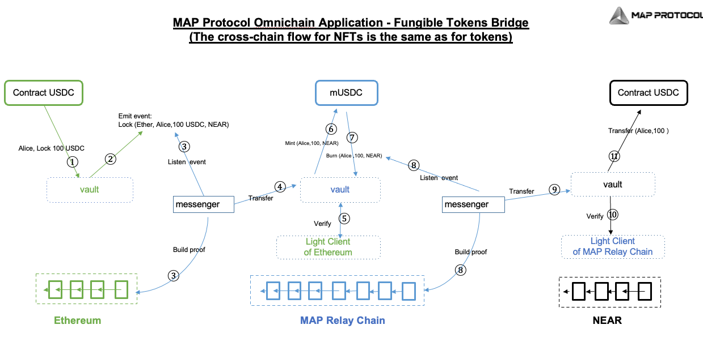
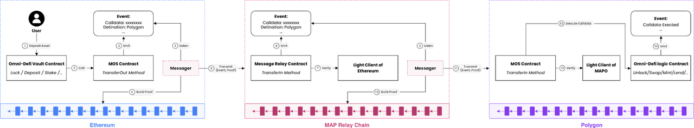
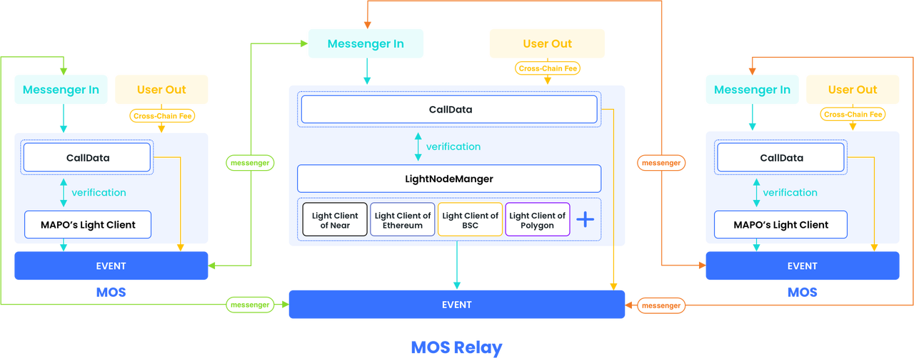

# 跨链流程

* MAP协议：Dapp 的 资产跨链=Asset Cross-chain 
  * 代币跨链
    * ZK改进的MAP中继链轻客户端点对点资产跨链流程 = 当一笔交易发起点对点跨链请求后的流程 
      * 图 
        * MAP Protocol Omnichain Application - Fungible Tokens Bridge ( The cross-chain flow for NFTs is the same for tokens)
          * 
      * 文字 
        1. Vault跨链智能合约（MOS组件）收到资产。 
        2. Vault合约发射包含有起源链地址，目标链地址，代币种类，金额的信息给到Messenger。 
        3. Messenger监听到这一事件，同时，为了验证这一事件的真实性，Messenger 需要在起源链上构建一个该事件上链的证明。 
        4. Messenger转发这个请求到中继链vault合约。 
        5. Vault合约将这一请求的真实性，交给起源链部署在中继链上的轻客户端智能合约进行验证。轻客户端智能合约存储了起源链最长链区块头信息，可验证该笔交易是否在起源链真实发生。 
        6. Vault合约在中继链上铸造同等数量的中继链版本的跨链请求资产。 
        7. Vault合约销毁铸造的资产。第六步和第七步是为了在中继链记账，所以铸造后又销毁。 
        8. Messenger监听到中继链上的事件，并在中继链上构建一个该交易上链的证明； 
        9. Messenger将消息转发到目标链的Vault合约； 
        10. Vault合约将跨链请求交给中继链部署在目标链上的轻客户端智能合约进行验证； 
        11. Vault合约收到轻客户端验证通过指令，将代币释放给起源链智能合约指定的目标链地址。 
  * MAP Protocol 去中心化跨链
    * 流程示意 
      * 以下为全链 dApp 实现去中心化跨链的流程示意图，展示了与dApp 逻辑活动相关的交易从Ethereum 经过 MAP Relay Chain 传递到 Polygon 
      * 流程图
        * 
      * 文字 
        1. 用户与在Ethereum dApp 逻辑合约中发生交互 
        2. 在相应相关逻辑完成后，该合约会去调用MOS合约中的TransferOut方法 
        3. TransferOut方法会Emit出相应的Event，该Event中包含了逻辑合约中交易的calldata 
        4. Ethereum-MAPO Messenger会监听到这个Event 
        5. Ethereum-MAPO Messenger会构建该Event所在交易的证明数据 
        6. Ethereum-MAPO Messenger会将该证明数据通过调用MAP Relay Chain上MOS合约的TransferIn 方法传递至MAP Relay Chain 
        7. TransferIn方法会去部署在MAP Relay Chain上的Ethereum的轻客户端中验证该证明数据 
        8. 如果验证成功，会Emit出相应的Event；其内容也包含了Messenger所传递的Event中的相同calldata 
        9. MAPO-Polygon Messenger会监听到这个Event 
        10. MAPO-Polygon Messenger会构建该Event所在交易的证明数据 
        11. MAPO-Polygon Messenger会将该证明数据通过调用Polygon上MOS合约的TransferIn 方法传递至Polygon 
        12. TransferIn方法会去部署在 Polygon上的 MAP Relay Chain的轻客户端中验证该证明数据 
        13. 如果验证成功，MOS 合约会去调用 Polygon上全链DAPP的逻辑合约并执行所传递的calldata 
        14. 全链DAPP的逻辑合约可以Emit出‘执行完成’类似的Event 
  * MAP Omnichain Service Message
    * 
