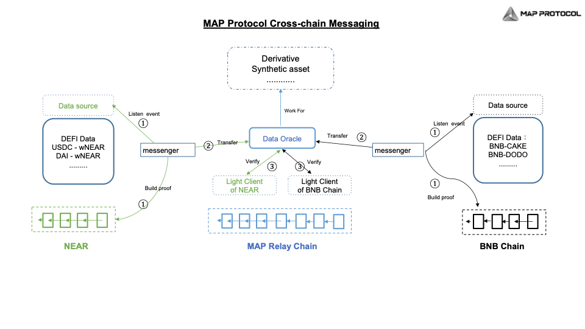

# Dapp层

* MAP协议 Dapp 应用层 = MAP Protocol Application Layer 
  * 资产跨链=Asset Cross-chain 
    * 详见：跨链流程
  *  消息跨链=Cross-chain Messaging 
    * MAP Protocol Cross-chain Messaging
      * 
    * 消息跨链适用于智能合约互操作，其基本步骤与资产跨链相同 
      * 消息跨链有众多应用场景，智能合约跨链互操作是最值得关注的场景之一。 
      * 去中心化金融的核心是可组合，同链间的智能合约组合带来了巨大的 DeFi 应用市场。不同链间智能合约的组合可以带来显著的去中心化金融效率提升。一个用户或一个智能合约，无论使用在任何链上任何代币，都可以去操作其他链上的 DeFi 产品，并在执行结束后，点对点 (Peer-To-Peer) 返回其原有的链上的原有资产。 
  * 开发相关 
    * 应用层包含了脉波这一全链基础设施的具体应用案例。这可以是全链且完全链上的GameFi、全链借贷、全链DAO等 
    * DApp开发者只需在MAP中继链上部署他们的DApp，并完成MOS模块的部署，就可以享受连接整个区块链世界流动性的特权 
  * OmniApp 的可能形式 
    * Omni-DeFi 
      * 全链 DeFi 协议指的是借助 MAP Protocol 的底层基础设施，可以接受来自不同链上的不同资产来参与经济活动的协议。 
    * Omni-Swap 
      * Omni-Swap是意在通过在不同的链上所创建流动性池加上MAP Protocol 无特权角色的跨链消息传递，使得用户可以轻松完成不同链上的资产兑换； 
    * Omni-Loan 
      * Omni-Loan是指一种可以在用一条链的资产做抵押并在另一条链借贷出资产的协议。这样做可以使得用户的单链资产在不跨链转移的情况下可以轻易的参与不同链间的经济活动。 
    * Omni-Staking 
      * Omni-Staking是指一种可以在用一条链的资产在不进行资产跨链兑换的情况下去参与到另一条链的 staking pool 的质押活动中获得收益。 
    * Omni-NFT 
      * 全链NFT是一种可以在链间流转，并且始终保持全链唯一性的NFT，在不同的区块链间始终维持一套统一的tokenID序列。 
    * Omni-PFP 
      * Omni-PFP是一种在可以在全链自由展示并且随意流转的唯一Profile for Picture NFT，用户可以在A链Burn掉他的NFT并选择在任意一条其他的链上铸造一个一样的tokenID的NFT，这些tokenID在全链范围内都是唯一的。 
    * Omni-DID 
      * Omni-DID是一个全链的ID/域名系统，允许用户的Omni-DID在全链注册并可被识别；用户在Ethereum上的Omni-DID注册合约中注册BNB Chain的DID关联地址后，BNB Chain的用户就可以通过Omni-DID给该用户转账或者类似的动作 
