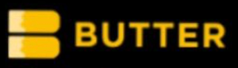
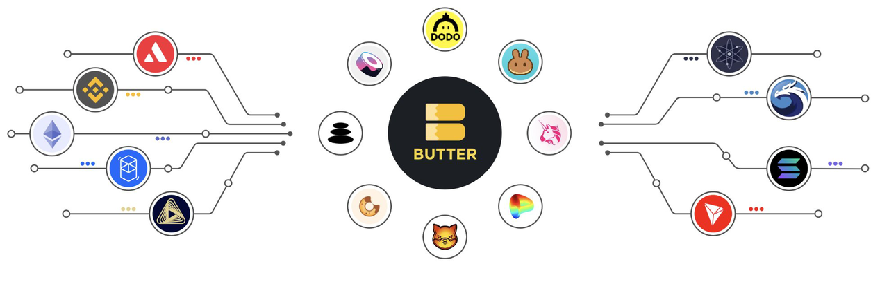
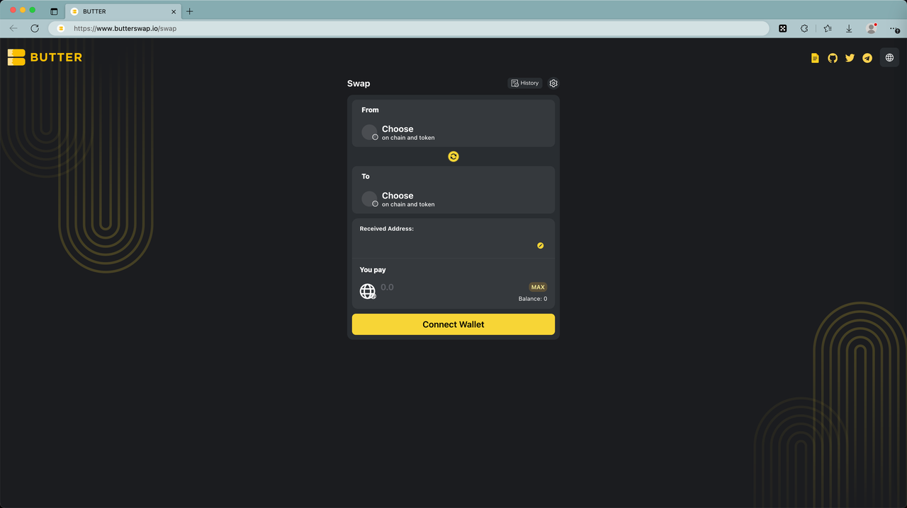

# ButterSwap

* butter = BUTTER = 黄油 = ButterSwap = Butter Network
  * 是什么：基于MAP协议的比特币跨链互换桥 
    * Butter Network is building the first fully composable decentralized cross-chain asset bridge, and the first dApp built on Mapo L2. 
    * ZK Cross-Chain Swap Bridge 
    * ZK跨链互换桥 
    * 比特币L2铭刻平台 
  * 目标 
    * Butter Network aims to help transform crypto assets movement across all blockchains seamlessly and securely with help of the cutting-edge light-client and zk technology Light-client 
  * 概述 
    * 第一个ZK轻客户端跨链聚合SWAP,一键在主流链和BTC生态系统之间进行交换 
    * Butter旨在帮助无缝,安全地改变BTC对所有区块链上的加密资产交换 
    * Butter 为Web3应用提供了一套前沿的产品,让用户在不知不觉中体验到资产跨链的便捷性 
    * Butter Swap 支持无需信任的方式从一个链无缝移动代币。你可以在 Butter Swap 中使用你钱包里的不同种类代币 
  * 支持网络 
    * ETH、MATIC、BNB、KLAY、CFX等 
  * Logo
    * 
  * 架构 
    * 
  * 主页 
    * [butterswap.io/swap](https://www.butterswap.io/swap)
      * https://www.butterswap.io/swap
        * 
    * Twitter 
      * [ButterSwap (@ButterSwap) / X (twitter.com)](https://twitter.com/ButterSwap)
        * https://twitter.com/ButterSwap
