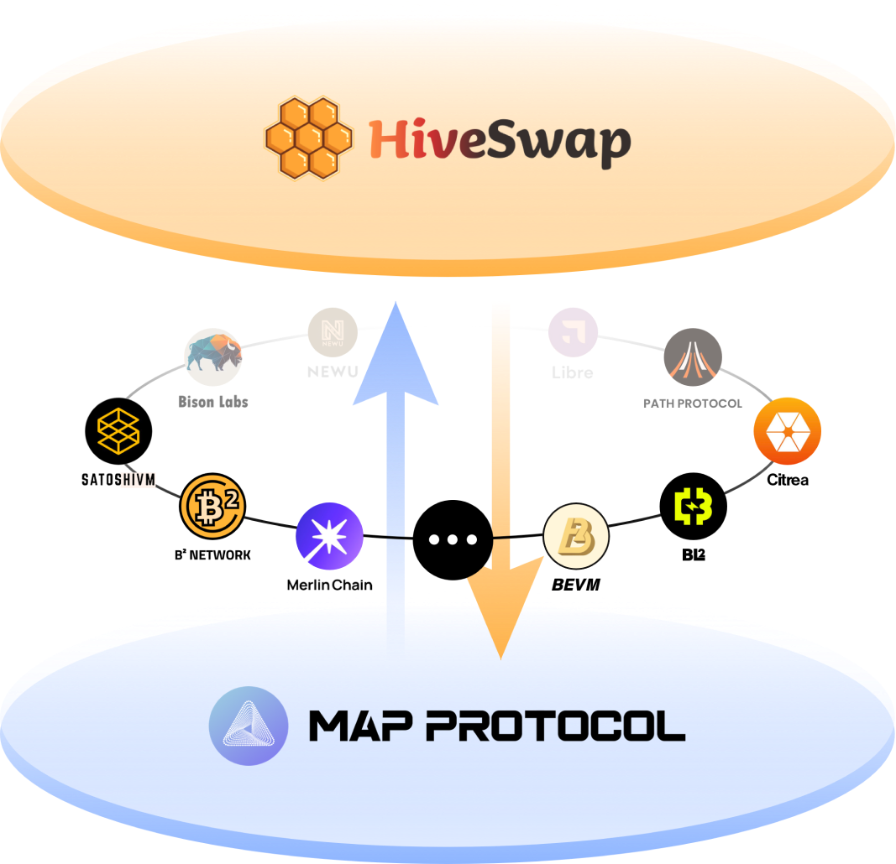
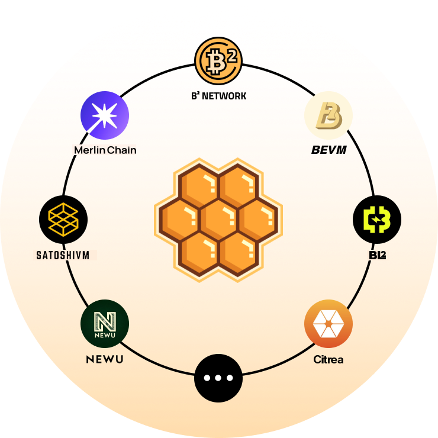

# HiveSwap

* HiveSwap = Hives 
  * 是什么：基于MAP协议的比特币L2层网络 
    * L2 liquidity pool swap 
    * L2 Liquidity Pool Staking 
    * L2流动性池质押 
    * 比特币L2流动交易池 
  * Logo 
    * 
  * 概述 
    * Hiveswap 支持在 MAP Relay Chain 上的代币交换。你可以直接在 Hiveswap 上获取 MAPO 
    * Hiveswap is the NO.1 SWAP in the Bitcoin ecosystem, utilizing the interoperable Bitcoin layer MAP Protocol to provide liquidity services for assets in the Bitcoin ecosystem, including assets on Bitcoin L1, the MAP Protocol interoperability layer, and various Bitcoin L2s. 
  * 核心逻辑
    * 
    * 
  * 特点 
    * Fully Realized interoperability of liquidity for Bitcoin network assets 
      * Fully covered assets on Bitcoin's Layer 1, Bitcoin's interoperability layer, and Bitcoin's layer 2, with the MAP Protocol interoperability layer as the starting point, enabling any swap of assets across the three layers 
    * Liquidity Interoperability between BTC and EVM Ecosystems 
      * HiveSWAP supports the peer-to-peer interoperability of assets from mainstream EVM chains such as Ethereum, BNB Chain, Polygon, Klaytn, Conflux, NEAR, Tron, etc., enabling the swap between assets on the Bitcoin network and EVM ecosystem assets 
    * Supporting the swap of inscription assets with various types of assets 
      * Enabling inscription assets to have sufficient liquidity in the decentralized world. 
    * Supporting the swap between $BTC and other types of assets 
      * Supporting liquidity pools for $BTC-related assets and other assets, to meet the decentralized liquidity exchange needs of $BTC asset holders 
  * 主页 
    * 旧 
      * [Hiveswap](https://www.hiveswap.io/)
        * https://www.hiveswap.io/
    * 新 
      * [Exchange | HiveSwap](https://pro.hiveswap.io/)
        * https://pro.hiveswap.io/
  * 文档 
    * [Hiveswap Intro | Hiveswap](https://docs.hiveswap.io)
      * https://docs.hiveswap.io
  * Github 
    * [HiveSwap (github.com)](https://github.com/hiveswap)
      * https://github.com/hiveswap
  * Twitter=X 
    * [Hiveswap (@hiveswap_io) / X (twitter.com)](https://twitter.com/hiveswap_io)
      * https://twitter.com/hiveswap_io
