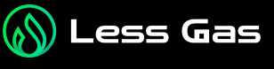
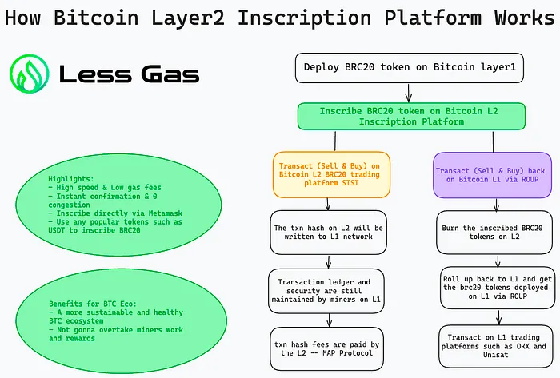
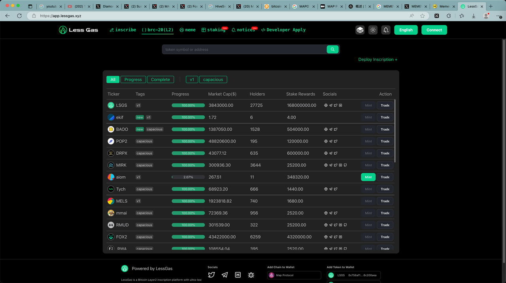

# LessGas

* LessGas 
  * 是什么：基于MAP协议的比特币L2层网络 
    * L2 inscription platform 
    * L2's first launch platform 
    * L2首个发射平台 
    * 比特币L2铭刻平台 
  * 概述 
    * LessGas is a Bitcoin L2 BRC20 inscription platform, offering a streamlined and cost-effective solution for the BRC20 token inscription and community-centric fair project launch. Leveraging the advance 
    * LSGS - 二层发射的引领者 
      * 大牛市预期：1LSGS = 1MAP 
      * 独特通缩策略：促进长期增值。 
      * 目标市值：100亿美元 
      * 加入LSGS社区：t.me/LessGasCN 
  * 代币：LSGS 
  * Logo
    * 
  * 原理
    * 
  * 主页 
    * [LessGas | Bitcoin Layer2 inscription platform with ultra-low gas fees,zero failures,and zero congestion](https://app.lessgas.xyz)
      * https://app.lessgas.xyz
        * 
