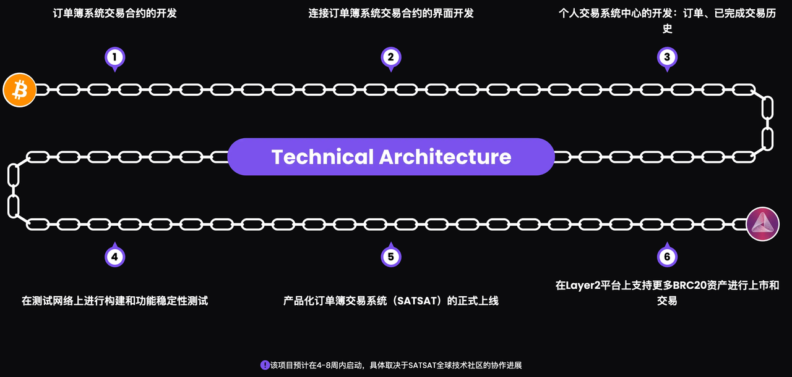

# SatSat

* 基于MAP协议的比特币L2层：SatSat 
  * 是什么：基于MAP协议的比特币L2层网络 
  * 功能： 
    * L2's first order book platform 
    * L2's first decentralized exchange 
    * L2's order book trading 
    * L2首个订单薄平台 
    * 基于比特币的BRC-20 
  * 概述 
    * 一个以社区为导向的比特币第二层BRC20交易平台，具有公平性、共享的收益、透明运作和低使用成本。 SATSAT是一个建立在比特币第二层网络MAP Protocol上的BRC20代币订单簿交易系统。它的功能类似于现有的比特币第一层订单簿交易系统，但基于比特币Layer2 MAP协议上构建，实现了极低网络费用的交易系统。此外，交易费收入将分配给社区成员。 
      * A Community-Oriented Bitcoin Layer2 BRC20 Trading Platform with Fairness, Shared Benefits, Transparency, and Low Gas Fees SATSAT is an order book trading system for BRC20 tokens that is built on the Bitcoin second-layer network, MAP Protocol. It functions similarly to the existing Bitcoin Layer 1 order book trading systems but distinguishes itself by being constructed on the Bitcoin second-layer network MAP Protocol, offering a transaction system with significantly lower gas fees. Additionally, the transaction fee revenues are allocated to the community members. 
    * STST - 交易平台的未来 
      * 大牛市展望：1STST = 1ETH 
      * 通缩模型：增强价值稳定性。 
      * 目标市值：100亿美元 
      * 加入STST社区：t.me/STSTCN 
  * 代币：STST 
  * Logo
    * 
  * 主页 
    * SATSAT
      * https://satsat.exchange/zh
    * STST-A Community-Oriented Bitcoin Layer2 BRC20 Trading Platform (satsat.exchange)
      * https://app.satsat.exchange
  * 项目进度
    * 
