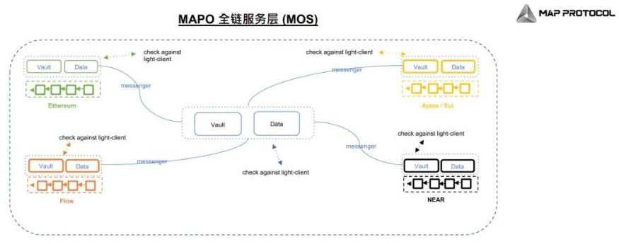
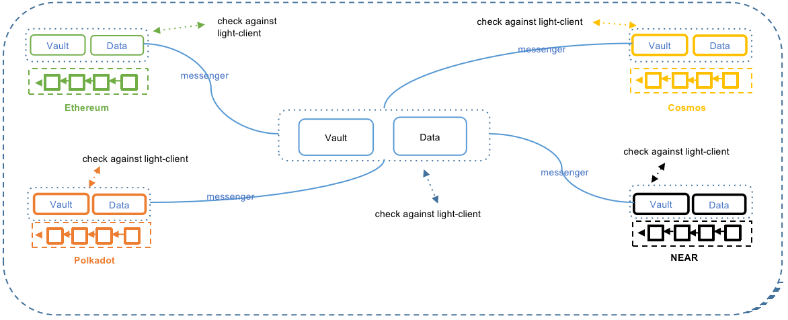

# MOS

* MAP协议=MAP Protocol 中的 
  * MOS=MAP Omnichain Service=MAP全链服务=MAP全链服务层= MAP跨链服务 
    * 概览图=架构图
      * 
      * 
    * 是什么：MAP Protocol 的第二层 
    * 类比： 
      * MOS之于MAP Protocol 
        * MOS 让 dApp 开发者可以轻松构建跨链或全链应用程序 
      * 就像GMS=Google Mobile Services之于Android 
        * 可以让Android开发者开发出各种应用 
    * 核心目标=作用：简化跨链 DApps 创造者的开发过程 
      * 简化跨链 DApps 开发和确保资产管理安全 
    * 如何实现目标 
      * 通过提供通常开发跨链 DApps 所需的一系列通用模块，它使开发者能够专注于他们应用程序的独特方面，如交换机制，而不是底层的跨链基础设施 
      * 考虑到一刀切的解决方案并不实用，MOS 还为开发者提供了必要的工具来定制和扩展现有模块，以满足跨链 DApps 的多样化需求 
    * 包含内容 = 组件 
      * Messenger=信使 
        * 是什么：一个独立的链间=跨链 程序 = 一个高并发的链间程序 
        * 作用：传递链间消息，监听相关事件 
          * 在源链账本上构建证明，并将消息传递到目标链的 Vault 或 Data。它操作高并发，能抵御恶意攻击，保护资产并维护跨链交易的完整性 
        * 费用 
          * Messenger 需要为终端用户预付MAP Protocol 网络或目标链的gas费 
            * 由于目标链的gas费无法估计，Messenger的奖励或回报需要从 dApp 方获得 
            * 应用程序的灵活性为 Messenger 提供了许多可能性，应用程序可以向全链用户收取灵活的交易费用并相应地奖励 Messenger 
              * DApp 开发者也可以独立灵活地激励 messenger 贡献者为 dApp 传递全链消息 
        * 恶意攻击 
          * Messenger的恶意攻击不会导致资产损失，只会导致 脉波协议层的跨链验证不会通过 
        * 相关 
          * Messenger Program = Messenger 的SDK 
            * 是一个 SDK 
            * 是MOS 的主要组成部分 
            * 对dApp开发者完全开放 =由 dApp 开发者自己部署、操作和维护 
      * （每个链上的）Vault & Data = 保管库 & 数据 
        * 是什么：是个智能合约？ 
        * 作用： 
          * 起始链上：接收资产或数据，并发送事件给Messenger 
          * 中继链或目标链上：接收 Messenger 传送的跨链信息，并将该请求转发到部署在中继链/目标链上的起源链轻客户端验证 
            * 验证完成后，Vault 和数据则会执行相应的指令 
        * 概述 
          * 在源链上，这些组件接收资产或数据，触发信使的事件。在中继或目标链上，它们接收跨链消息，通过轻客户端验证交易，并记录指令。它们提供了可由 dApp 开发者部署的灵活性，开发者也可以通过 MOS 利用共享的流动性池。 
      * 其他的跨链消息组件 
        * other cross-chain message components 
    * 使用方式 = DApp 开发者使用MOS的方式 
      * 独立运行MOS 或使用 MOS 提供的服务 
      * 使用 MOS 中的 Vaults 和 Data，并与其他应用程序共享 Vaults 和 Data 的流动性 
    * 示范工作流程 
      * 使用 AssetVault 进行跨链转移 
        * 说明 
          * 跨链转移中最关键的方面之一是资产管理，这可能充满了错误和安全风险，通常由拥有访问用户资金的超级管理员的存在而加剧。MOS 通过其强大的 AssetVault 模块解决了这些问题。这个坚不可摧的构造消除了特权管理员，确保所有与资产相关的操作只能由有效的加密证明（如 Merkle 证明）支持的跨链消息触发。这些证明被轻客户端的信息严格验证，增强了系统的无需信任性。 
        * 让我们考虑一个场景，Alice 希望使用 MAP Protocol 将 100 USDC 从以太坊转移到币安智能链 (BSC)： 
          * 启动：Alice 在以太坊的 AssetVault 合约中锁定她的 100 USDC。 
            * 锁定事件和信使角色：发出一个 Lock 事件，信使构建一个 Merkle 证明以验证事件。然后，这个证明提交给 MAP 中继链上的 AssetVault。 
            * MAP 中继链上的 AssetVault：AssetVault 验证加密证明，并指示 mUSDC 合约铸造并随后燃烧相当的 mUSDC，标志着 Alice 意图将资金转移到 BSC。 
            * 最终转移到 BSC：另一个信使提交一个包含必要证明的交易到 BSC 上的 AssetVault。验证后，AssetVault 将 100 USDC 转移到 Alice 在 BSC 上的地址，完成跨链转移。 
