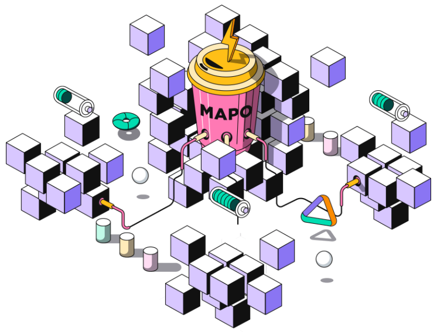
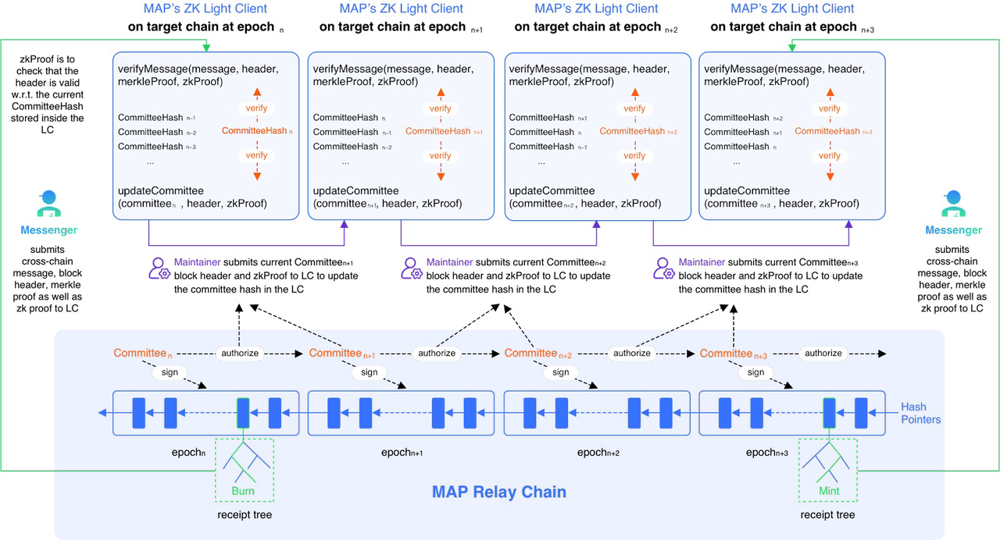

# MAP Relay Chain

* MAP协议=MAP Protocol中的 
  * MAP Relay Chain=MAP中继链 
    * == MAP Protocol Network=MAP协议网络 
    * == MAP mainnet=MAP主网=MAP主链 
      * = MAP协议主链==MAP协议主链公链 
    * 是什么：一个兼容 EVM 的区块链 
      * 在 MAP Protocol 的协议层上运行
        * 
    * 共识机制/算法：PoS + BFT 
      * PoS=权益证明 
      * BFT=Byzantine Fault Tolerant=拜占庭容错 
        * == IBFT = Istanbul Byzantine Fault Tolerant= 伊斯坦布尔拜占庭容错 ？ 
    * 架构 
      * ZK-Improved Light Clients for MAP Relay Chain = 零知识改进后的轻客户端的MAP中继链
        * 
    * 特点 
      * 能源效率高 
      * 安全 
      * 稳定 
    * 核心功能 
      * 为所有连接的区块链维护轻客户端 
    * 作用：连接不同的区块链 
      * 主动扩展和支持虚拟机中的异构区块链功能，并构建了一个高效的轻客户端验证网络 
      * 支持跨链转账和交换 
      * 不仅仅连接同一生态系统内的同构链，还包括蓬勃发展的 EVM 领域的异构区块链 
        * 不仅链接：BTC = 同构链 
        * 还链接：以太坊 = EVM = 异构区块链 
    * 主要目的：维护所有感兴趣区块链的轻客户端，并促进跨链消息的无需信任的验证 
    * 相关 
      * 验证者：保证全链网络多样性和强健性的关键 
      * MAPO：用于支付在 MAP Protocol 网络 上产生的网络费用的加密货币 
