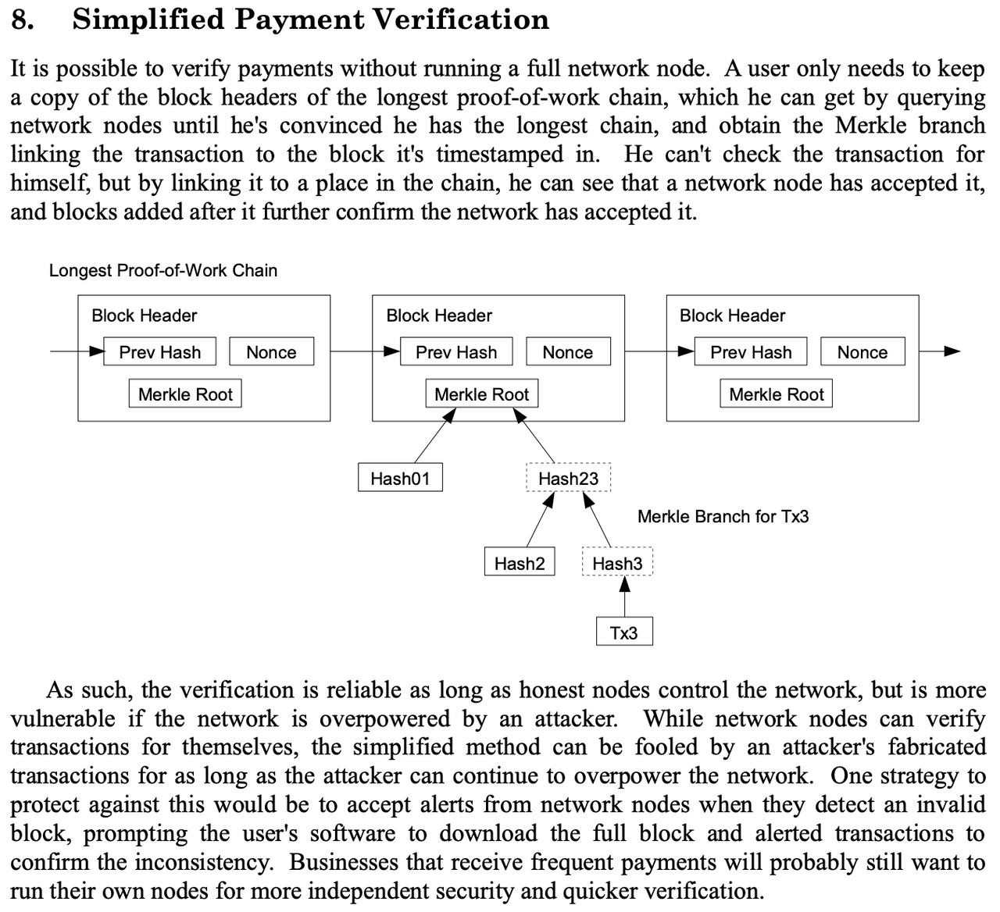

# ZK-LightClient

* 相关名词 
  * MPC = Multi-Party Computation=多方计算 
* 比特币（领域内）：Light Client technology = 轻客户端技术 
  * 名称 
    * == lightweight client = 轻量级客户端 
    * == 简化支付验证 = SPV = Simplified Payment Verification 
      * 由Satoshi Nakamoto 定义，在比特币白皮书中提到的技术
        * 
      * 中本聪定义的SPV后来被学术界演进成为轻客户端技术 
    * 被称为：Holy Grail technology = 圣杯技术 
  * 是什么：一种验证技术 
  * 含义=作用 
    * 旨在无需下载整个区块链即可与区块链网络互动 == 用于仅通过验证区块头来验证交易是否确实发生在链上 
      * designed to interact with blockchain networks without downloading the entire blockchain 
  * 特性 
    * 自验证=self-verifying 
* ZK technology=零知识证明技术 
  * 概述 
    * 以太坊创始人Vitalik大力倡导的，也可以实现链上交易的链下轻量级验证 
* MAP的：ZK-LightClient 
  * =ZK Light-Client = zkLightClient = 零知识证明轻客户端 
  * 背景 
    * 轻客户端验证问题 
      * 在 MAP Protocol 中的轻客户端是作为智能合约构建在 MAP 中继链和所有连接的区块链上的。尽管这比如多方计算（MPC）等解决方案更安全和去中心化，但轻客户端验证网络的燃料费消耗量更大，这样的成本效率可能不足以实用，也不足以服务于跨链目的。为了提高效率，轻客户端可以验证一个 ZK-SNARK 证明来确认一个区块头部信息是有效的。 
        * Light clients in MAP Protocol are constructed as smart contracts on MAP Relay Chain and all connected blockchains. Although this is more secure and decentralized than solutions such as Multi-Party Computation (MPC), the amount of gas fee consumption with light clients verification network is more costly, which will not be efficient and practical enough to serve for cross-chain purposes. To improve efficiency, light clients can instead validate a ZK-SNARK proof that a block header is valid 
      * 即： 
        * 只用LightClient=轻客户端 -》高gas费 
          * 在不依赖第三方特权角色 == 去中心化 的情况下，验证一笔交易是否真的发生在另一条链上，仅使用 Light Client 技术意味着更高的 gas 费用 
          * 验证成本相比于其他依赖第三方的跨链方案则会更高，效率也会相对偏低 
        * 只用ZK=零知识证明 -》计算量太大=效率太低 
          * 而仅使用 ZK 意味着非常冗长的证明计算 
      * -》 MAP的优化后的：ZK-LightClient：（点对点跨链验证）效率高=速度快、Gas费率低 
  * 概述 
    * ZK Light-Client = ZK + Light-Client 
  * 底层技术 
    * 验证逻辑概述 
      * 输入的区块头在当前commit值所代表的验证者集合信息中是否为正确的区块。这一判断的成立与否取决于随著区块头一起输入的zkSNARK证明 
    * 实现原理 
      * ZK 零知识证明 
        * BLS聚合签名算法：验证起源链的 BLS 聚合签名哈希值 
          * ->提升（跨链验证）效率 
      * SPV=简单支付验证 = 轻客户端LightClient 技术 
        * 轻客户端智能合约验证默克尔证明，并对ZK 证明进行再次验证 
          * ->实现：跨链 
    * 实现目标 
      * 基于zkSNARK 技术来改进MAP中继链的轻客户端实现，旨在解决两个问题 
        1. 减少数据存储量 -> 降低Gas费 
          * 减少轻客户端合约中所需存储关于MAP中继链元信息的数量，降低轻客户端本身状态更新时的燃气费消耗 
        2. 用zk-SNARK的Groth16验证-> 降低Gas费 
          * 将区块头合法性验证过程中签名合法性以及签名权重检查部分放入零知识证明电路中，利用Groth16（一种zk-SNARK协议）方案完成验证，以降低燃气费消耗 
  * 实现细节 
    * 在 MAP Protocol 中的轻客户端是作为智能合约构建在 MAP 中继链和所有连接的区块链上的 
      * Light clients in MAP Protocol are constructed as smart contracts on MAP Relay Chain and all connected blockchains. 
      * = MAP中继链的轻客户端，部署在EVM链上 
        * MAP Relay Chain light client, deployed on EVM chains 
  * ZK-LightClient包含内容 
    * LightNode 
      * LightNode contracts for EVM compatible chain sync block and transaction verification 
    * VerifyTool 
      * The VerifyTool contract is suitable for parsing the data of the LightNode contract and provides some reliable methods 
    * LightNodeProxy 
      * LightNodeProxy is the contract for LightNode upgrade 
  * 验证机制 
    * PoS机制的 L1 与POW机制的 L1 存在不同的区块头类别 
      * PoS机制下，区块头校验的核心是校验Validator的签名信息 
    * 起源链为PoS机制区块链 
      * 当起源链轻客户端部署在目标链上智能合约后，在起源链的验证者集合换届的情况下，维护者会将起源链验证者集合的 BLS 聚合签名和投票权重写入目标链上部署的起源链轻客户端智能合约，目标链上部署的轻客户端智能合约存储起源链多届（中本聪最长链原则）验证者委员会的验证者公钥和投票权重；因 POS 机制链的每届验证组都由上一届验证组委员会签名授权产生，维护者作为链外程序，若试图写入虚假的起源链验证者集合信息到目标链轻节点，存储在轻节点（轻客户端）智能合约中上一届验证组的签名验证者信息校验并不会通过其写入请求，因为虚假的签名验证者集合并无上一届委员会的签名授权；若要通过，则需要攻击整个起源链，或者重写智能合约。至此，点对点的独立自验证得以保证。 
    * 起源链为PoW 机制区块链 
      * 其起源链轻客户端部署在目标链上智能合约的情况下，维护者负责同步起源链最新区块头信息至目标链轻客户端合约；目标链上部署的轻客户端合约存储起源链最新的第N个区块头；维护者若试图将虚假区块头写入起源链，虚假信息并无匹配的上一个区块头哈希值，故并不会被存储在目标链上的轻客户端智能合约接纳。 
  * 验证内容 
    * 主要由部署在目标链上的起源链轻客户端智能合约执行 
      * 两种验证 
        1. 区块头的正确性验证 
          * 验证维护者请求写入的区块头的合法性，根据链共识机制的不同，该验证方案会有所差异 
            * 对于采用PoS和BFT机制的链，通常是验证区块头中包含的合法签名所代表的投票权重超过2/3 
        2. 默克尔证明的验证 
          * 验证在特定的区块高度中有emit特定事件，所需的正确的Merkle根值在区块头中，由第一步确保正确性，在与以太坊结构类似的区块链群体中，该默克尔证明通常是MPT(Merkle Patricia Trie)的存在性证明，也即收据树MPT中确实存在特定的event 
  * 验证流程 
    * 概述 
      * 在MAP中继链轻客户端智能合约中，需要存储当前epoch的所有验证者的公钥以及质押权重信息。当验证新区块头的合法性时，根据区块头中的信息和轻客户端自身存储的当前验证者信息，轻客户端合约可以计算出验证区块头中聚合签名所需的聚合公钥。如果聚合签名验证通过，并且聚合公钥所代表的验证者的投票权重之和超过了2/3，那么区块头就会通过验证 
      * 基于zkSNARK构建的MAP中继链轻客户端中，只需要存储关于当前验证者集合元信息的commit值，即SHA256((pk_0, wt_0), (pk_1, wt_1), ... , (pk_n, wt_n))。这意味著轻客户端合约从需要存储n个公钥和权重信息精简为只需要存储256比特的commit值 
    * 示例说明 
      1. 根据输入的区块头，以及hashToBase计算出t0和t1。 
      2. 将t0和t1以及自身存储的当前验证者集合的commit作为公共输入，按照groth-16方案验证zk-proof的合法性。 
      3. 如果第二步验证通过，则表示区块头是合法的，接著从中提取出Merkle Patricia Tree（MPT）的根节点（MPT root），继续验证mpt-proof的合法性。 
