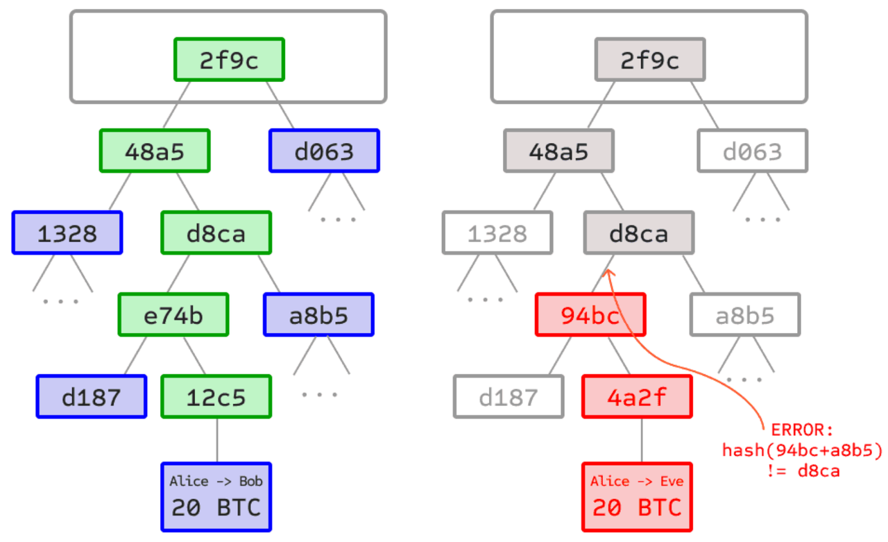

# 白皮书

背景
* 背景 
  * DeFi=去中心化金融 三个发展阶段 
    * 阶段一：比特币 
      * 比特币点对点电子现金支付系统诞生，开创了加密货币行业，并推动了中心化交易所的发展，也为以太坊和其他Layer1的诞生提供了基础； 
    * 阶段二：以太坊的智能合约 
      * 2015年以太坊可编程智能合约出现，推动了公共链Layer1 和去中心化应用的发展； 
    * 阶段三：全链 
      * 全链点对点互操作基础设施 脉波诞生，让dApps无缝覆盖各种链实现智能合约互操作成为可能 
  * 全链方案 = 跨链方案 = 对点跨链互通 = 点对点跨链互操作 
    * 两大难题 
      * 数据如何通信？ 
        * 1. 各链的签名算法和Hash算法，区块产生共识机制不同，即异构链之间数据格式不同，各链的数据如何互相通信？ 
      * 如何不依靠第三方？ 
        * 2. 对于链间消息传输程序所传输的跨链请求，如何确保其在起源链真实发生而不依靠第三方？ 
    * MAP之前 
      * 1. 中心化交易所：其特点是由中心化机构通过KYC、冷钱包、监管合规等方式确保用户资产兑换安全； 
      * 2. 链外第三方共识方案 
        * MPC 
          * MPC跨链桥无法消除特权角色的存在，容易出现坚守自盗或黑客攻击事件 
        * Oracle=预言机 
          * 而预言机 (Oracle)方案虽然基于区块头进行验证，但预言机 (Oracle)节点作为链外第三方，有权篡改提交的区块头信息，从而导致虚假验证 
        * 中继链验证人 
          * 中继链验证人则是对起源链的跨链请求进行跨链验证，即链下验证 (off-chain work)，也属于链外第三方验证，存在共谋风险 
        * OP=Optimistic Rollups=乐观验证 
          * OP 验证尽管安全条件设置苛刻，但验证等待时间过长。 
      * 3. Polkadot 与 Cosmos：二者属于比特币级别的点对点跨链方案，但是仅限内部生态链跨链通讯，EVM链和其他异构链无法实现与二者的点对点跨链互通 
    * MAP 
      * 实现跨链手段：ZK-LightClient=零知识证明轻客户端 
        * 其他 
          * 内置预编译合约 
            * 兼容了各类Layer1的签名哈希、挖矿算法、挖矿、Merkle Tree证明 
      * 对比 
        * Plokadot 和 Cosmos 
          * 仅支持同构链之间的跨链互通，不支持其他链的跨链需求 
        * MAP Protocol 
          * 支持同构链、其他链=异构链的跨链 
MAP协议=MAP Protocol=脉波
* MAP协议=MAP Protocol=脉波 
  * 概述 
    * 专注跨链的比特币二层网络 
      * 比特币二层和基于轻客户端与ZK的点对点全链基础设施，专注于点跨链互操作，跨链过程中不依赖任何特权第三方，完全点对点，纯代码信任，为 dApp 提供全链智能合约开发平台和比特币生态提供互操作性 
  * 特点 
    * 无需链外可信的第三方角色/组织 
      * 防止双重支付 = 交易无双花 
  * 区块头和默克尔树 
    * 供默克尔树子节点攻击无效
      * 
      * 说明 
        * 左：仅提供默克尔树上的少量节点已经足够给出分支的合法证明。 
      * 右：对默克尔树任意部分进行改变的尝试最终都会导致链上某处不一致 
  * 架构层级 
    * 目的：实现整体的灵活性和稳健性 
    * 包括 
      * 应用层=Dapp 
        * MAP Protocol全链智能合约生态应用 
      * 全链服务层=MOS 
        * 为了帮助 dApp快速部署跨链智能合约应用而提供的一系列组件工具 
          * Messenger=跨链交易转发角色 
          * 跨链锁仓智能合约 
          * 消息跨链组件 
      * 协议层 
        * 负责跨链交易的验证及点对点执行网络 
        * 包括 
          * MAP中继链=MAP Relay Chain 
            * 共识机制：PoS 
              * 与比特币等工作量证明系统 (POW) 相比，对环境更友好 
              * POS 机制下，用户可以进行更便宜、更快速且交易结果一旦完成就无法更改的交易 
            * 共识算法：IBFT=伊斯坦布尔拜占庭容错 
              * 即使多达三分之一的节点处于离线状态，或是错误、恶意的，其中一组明确定义的验证器节点也能按照一系列步骤在它们之间广播签名消息以达成协议 
              * 当法定人数的验证者达成一致时，该决定就是最终决定 
            * 独一无二的特征 
              * 在预编译合约中，内置了几乎所有链的不同核心算法 
          * Maintainer=维护者 
            * 一组链外角色 
            * 负责将起源链共识层最新的区块头和默克尔树证明，更新部署到目标链上的起源链轻客户端智能合约中 
            * 对Maintainer的恶意攻击是无效的 
              * 虽然维护者为链外程序，但在轻客户端智能合约正确诚实的初始化状态后（链接的浏览器对应轻客户端页面），维护者并无任何机会篡改随后追加的轻客户端状态，即区块头和默克尔树。因此，维护者的任何恶意攻击对轻客户端智能合约都是无效的 
          * ZK轻客户端=ZK-LightClient 
            * 详见：ZK-LightClient
