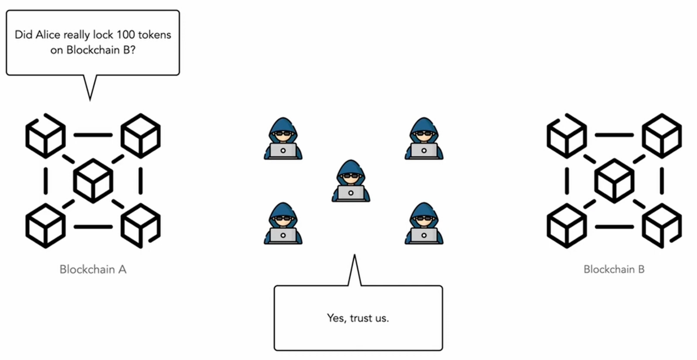
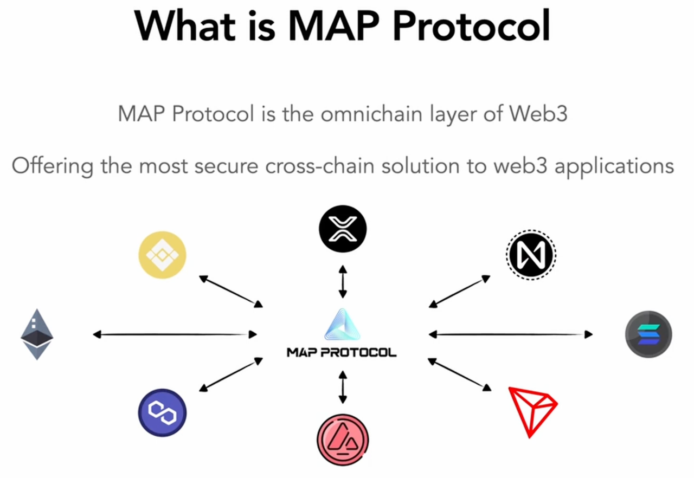
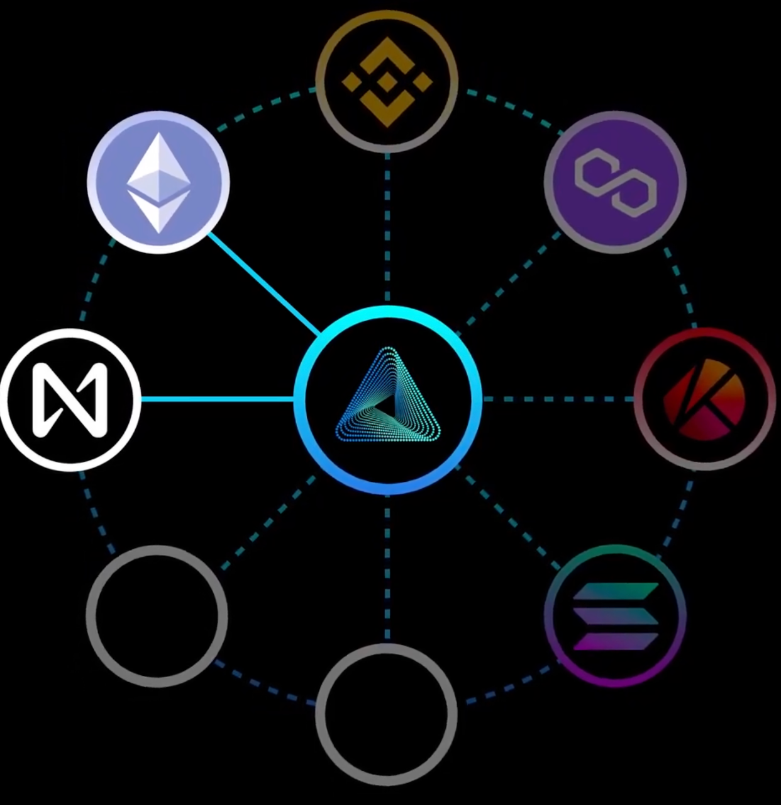
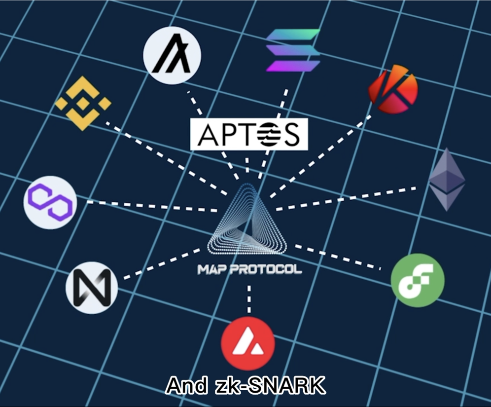
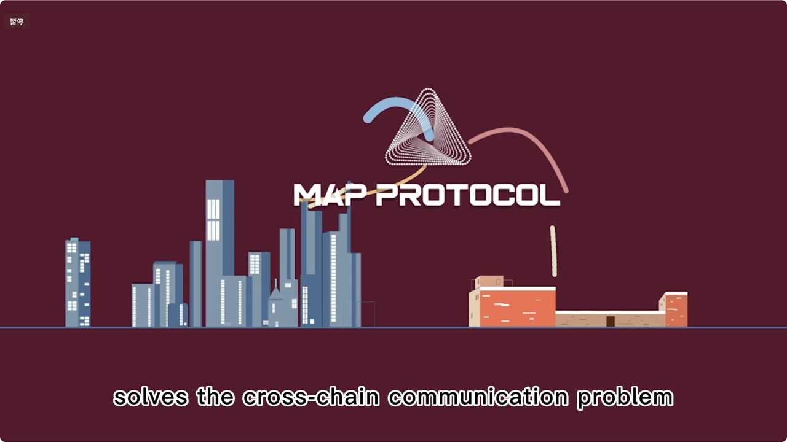
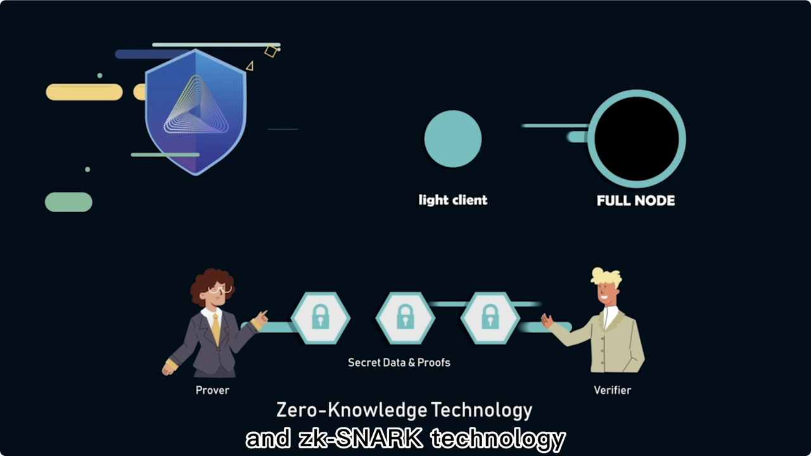
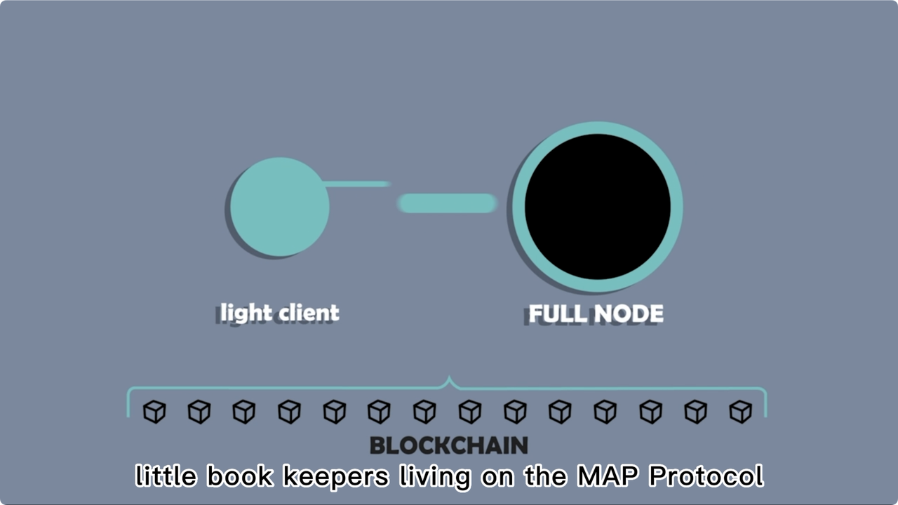
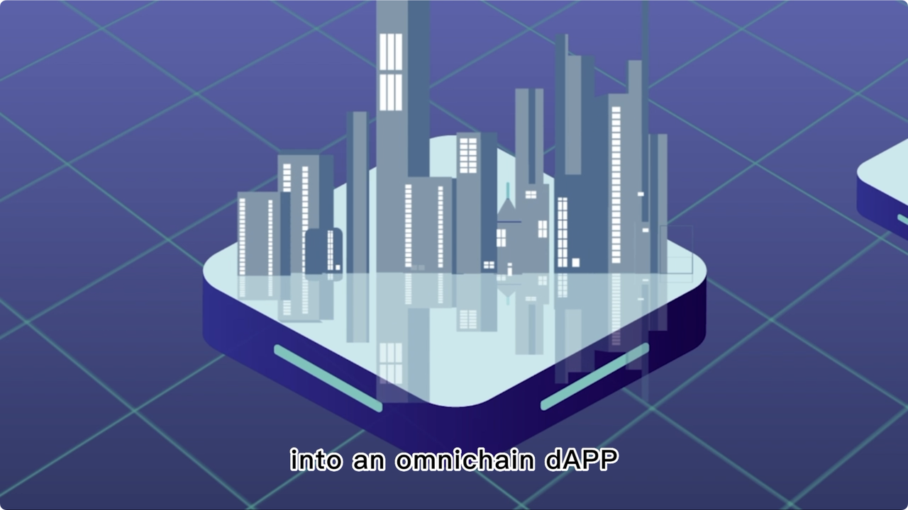
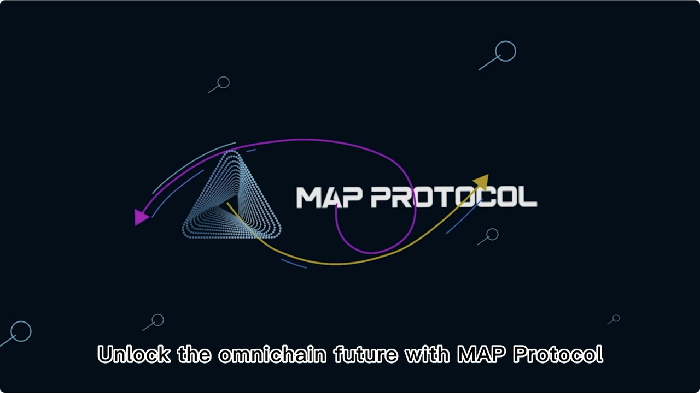

# MAP Protocol概览

* MAP Protocol=MAP协议=脉波协议 
  * 是什么：比特币的L2  == 比特币的各种L2的L0 
    * A Bitcoin L2 for peer-to-peer interoperability, built on ZK light-clients 
    * 是比特币二层网络，也是一个点对点的全链互操作网络，专注于跨链互操作性 
  * 核心要点 
    * MAP协议= zkLightClient 
      * = zkLightClient  + 智能合约? 
      * = ZKP + LightClient + 智能合约? 
      * = 零知识证明 + 轻客户端  
        * ZKP = Zero-Knowledge Proof = 零知识证明 
          * ZK是提高验证速度，通过验证zk proof来快速验证，可以节约gas fee 
        * LightClient = Light-Client = 轻客户端 
          * 轻客户端是 智能合约式的验证，有别于多签的验证，所以安全 
        * 智能合约 ：（比特币<->其他生态）点对点互操作 == 跨链资产互操作 
    * => 
      * 实现了一个纯粹的、点对点的、完全的、可互操作的、跨链验证网络 == 区块链生态系统 
        * 只依赖验证，不依赖任何第三方 == 点对点，无特权第三方 
  * 功能：实现了各种比特币 L2 网络之间的互操作性 
    * 为比特币生态系统开发人员提供了一个统一的、可互操作的基础设施，涵盖了广泛的可互操作的比特币L2 
  * 概述 
    * MAP Protocol 是一个用于点对点跨链互操作的比特币第二层网络 
    * MAP 协议作为比特币 Layer-2 网络，也是一个专注于跨链互操作性的点对点互操作全链网络，是开发者和用户的 Web3 网关 
    * 一个全链基础设施 
      * 它为基于区块链的资产、存储和计算提供了实现跨EVM和非EVM链互操作性的基础设施。作为一个全链基础设施，脉波上不依靠信赖任何第三方进行跨链通信。唯一信任的是代码，这些代码利用轻客户端的自验证特性，以完全点对点的方式进行跨链。 
  * 详解 
    * 比特币L2们的第零层、比特币生态与其他生态之间互操作的比特币第二层网络 
      * 通过利用比特币网络的安全机制，MAP Protocol的安全性受比特币网络确保，并通过的 BRC201 协议 实现一层和二层之间的资产跨链。同时，通过成功研发的尖端 ZK-LightClient 技术，实现各个比特币第二层之间的点对点互操作，以及其他公链与比特币网络之间的互操作 
    * 比特币级别的点对点跨链网络 
      * 与“纯粹的点对点”比特币网络类似，MAP Protocol 的跨链网络也是点对点的，不经过任何第三方。跨链请求的有效性完全取决于它是否已在源链上发生，而不是依赖于可信第三方的决定或证明。 
    * 构建覆盖所有比特币二层的应用 
      * 众多的比特币二层应该是一个整体，而非割裂。我们为开发者提供了一整套的 开发工具、教程和SDK，通过MAP Protocol的比特币二层网络，开发者可以尽可能轻松地构建覆盖所有比特币二层的跨链dAPP，而这一切就像在单个链上构建应用一样简单。 
    * 用于互操作的链上资产、存储和计算的基础设施 
      * 互操作性不仅仅是连接不同链上的不同代币。一个真正去中心化的 Web3 是资产、存储和计算都在链上并且可互操作的地方。我们提供用于互操作的链上资产、存储和计算的基础设施。 
  * 可以理解为 
    * Web3 的用户入口 
      * 硬核技术细节和复杂的跨链步骤阻碍了新用户进入 Web3 世界。MAP Protocol 使得导航 Web3 直观。在 MAP Protocol 中，用户只需要知道他们完全拥有自己资产的事实，当他们将资产从一个链移动到另一个链时，这是纯粹的点对点，没有任何第三方可以干预。 
    * 一站式开发者门户 
      * 数据主权是 Web3 的核心，意味着用户对其数据拥有完全的所有权。要构建一个 Web3 应用，开发者需要结合不同区块链的功能，使得用户的资产、存储和计算都在链上。通过 MAP Protocol，开发者可以无缝组合不同的区块链组件，并构建应用程序，让用户对其数据和资产有控制权。 
    * 自由和点对点资产流动的守护者 
      * Web3 是新的价值互联网。互联网价值的流动可能面临第三方的安全担忧和挑战。虽然在单个区块链中的资产流动已经是点对点的，但 MAP Protocol 更进一步，使得不同区块链上的资产能够以纯粹的点对点方式流动。 
  * MAP Protocol 能做什么 
    * 比特币生态系统增长 
      * 由于 MAP Protocol 是比特币第二层，任何链上的资产都可以轻松地与比特币网络互动。这将把其他类型的资产和社区加入到现有的比特币生态系统和社区中。 
    * 可互操作的链上存储和计算 
      * 除了资产转移，MAP Protocol 扩展了互操作性范围，包括链上存储和计算资源，允许 dApp 开发者高效利用跨多个区块链的服务。 
    * 增强的安全性和隐私性 
      * 除了构建在轻客户端和零知识证明技术之上，MAP Protocol 还利用比特币网络加强了安全性，以防止长距离攻击。 
    * 对开发者友好的平台 
      * 凭借其 Web3 用户入口和开发者门户，MAP Protocol 为开发者提供了构建和部署跨链应用所需的工具集，有效地促进了区块链创新的发展。 
    * 用户赋权 
      * 用户可以轻松创建 MAP Protocol 账户并探索或贡献于全链生态系统。没有中央权威可以更改规则或限制访问，从而为用户提供了无与伦比的控制权。 
    * 点对点网络 
      * MAP Protocol 全链网络允许点对点交易和互动，坚持区块链技术最初的去中心化精神，同时提供跨链能力的优势。 
  * 特点 
    * 全链互操作性 
      * 脉波允许EVM和非EVM链的点对点跨链互操作性。 
    * 比特币网络加强的安全 
      * 脉波利用比特币网络安全机制来保护中继链 
      * 利用轻客户端自验证特性保护跨链交易 
        * 使用 ZK 技术重构了轻客户端 
    * 无第三方信任 
      * 脉波是去中心化的，没有单一实体控制，所有参与者都依赖于代码进行操作。 
      * 实现了这个纯粹的点对点、无第三方的跨链验证网络 
        * 纯粹的点对点 
          * 从第一行代码开始，MAP Protocol 就体现了中本聪的点对点、无第三方理念 
    * 灵活性：允许不同区块链的集成，包括具有不同签名、哈希算法和默克尔证明的区块链。 
  * 为什么要使用 MAP Protocol 
    * 解锁比特币生态系统的未来 
      * 由于缺乏图灵完备性，比特币在可用性上与以太坊相比存在限制，其生态系统的增长也较慢。然而，随着 BCR-20 代币和 Ordinal NFTs 在 2023 年 5 月接管了 Web3 领域，比特币生态系统的新叙事撤销了关于比特币互操作性的话题和辩论。 
      * 通过 MAP Protocol 的 BRC-201，一种对 BRC-20 代币的跨链扩展协议，比特币网络上的 BRC-20 和 ORC-20 资产可以与其他公链上的其他代币互动。这一层比特币网络的跨链互操作性也将整体增长比特币社区。 
    * 迈向真正互操作的未来 
      * 今天，大多数互操作性解决方案只强调资产跨链交易。然而，一个真正互操作的 Web3 未来的范围远超此——在这个未来中，包括交易、数据存储和计算在内的 dApp 操作将在区块链上执行，并且可以跨不同链互操作，赋予用户对他们的数据和隐私的完全控制。 
      * MAP Protocol 为这个真正互操作的 Web3 未来铺平了道路。通过 MAP Protocol，开发者可以无缝整合各种区块链组件，实现所有操作都在链上进行的应用程序构建。这为用户提供了跨多个链对他们的数据和资产的完全控制 
    * 进一步赋能玩家 
      * 传统上，玩家受到中心化游戏服务平台的限制，实际上并不拥有他们购买或获得的游戏内物品。为了交易或转移游戏资产，玩家被迫使用黑市网站，这往往带来额外的安全风险。 
      * 区块链游戏改变了这种旧的游戏方式。像 Crypto Kitties、Axie Infinity 和 Dark Forest 这样的 Web3 项目创造了一个新的游戏范式，在这里玩家被鼓励交易游戏内物品，并因他们的游戏时间而得到奖励。然而，与许多初创的创新一样，这些区块链游戏项目远非完美，由于可扩展性问题、交易费用和管理基于区块链资产的复杂性，已经让真正的玩家失去了兴趣。 
      * 这就是全链条和完全链上游戏的用武之地。通过 MAP Protocol，GameFi 项目不仅可以在所有链上交易和互操作游戏资产，还可以在区块链上实现游戏状态、逻辑和数据的所有方面，从而使区块链游戏成为一个玩家拥有完整代理权并为游戏开发做出贡献的自治世界。 
    * 实现轻松的跨链资产流动 
      * MAP Protocol 利用轻客户端和零知识证明（ZK Proofs）提供一个无需信任的环境，以实现包括 EVM 和非 EVM 链在内的多个区块链之间的无缝资产转移。这消除了对中心化权威或第三方服务的需求，强化了去中心化原则的同时确保了交易的安全性和效率。 
      * MAP Protocol 不仅支持简单的资产转移，还实现了用于存储和计算能力的跨链通信。这为去中心化应用程序（dApp）开发者提供了前所未有的灵活性，用以构建更加健壮、可扩展和互操作的应用程序。这项技术是对区块链生态系统的关键贡献，使我们更接近一个真正互联的世界，在这个世界中，资产和资源可以在各个链之间毫不费力地流动。 
    * 节省时间和金钱来构建出色的应用程序 
      * 在单一链上构建是简单且维护成本低的，但同时也限制了用户的覆盖范围和适应性，因此需要额外工作才能部署在其他链上或使用潜在不安全的跨链解决方案。此外，在多个区块链上建设意味着同时管理多个账本，这可能比在单一链上操作更困难也更昂贵。 
      * 与其在两害之间选择较小的一害，牺牲时间和资源变成多链或跨链，并在功能开发上妥协，项目和开发者可以直接在 MAP Protocol 上部署或使用 MAP Protocol 成为全链通，他们无需花额外的时间和金钱去寻找跨链解决方案或使用桥接技术成为多链。 
      * 有了 MAP Protocol，项目只需专注于应用开发的所有基本要素，并找到提升用户体验的方法，这样创新就能到来并推动真正的 dApp 大规模采用。 
  * 对比 
    * 旧的
      * 
    * MAP Protocol 
      * 互联效果 = 全链效果 = 互操作效果
        * 
        * 
        * 
  * 其他介绍
    * 
    * 
    * 
    * 
    * 
    * 
* MAP浏览器 
  * [MAPO SCAN](https://www.maposcan.io)
    * https://www.maposcan.io
